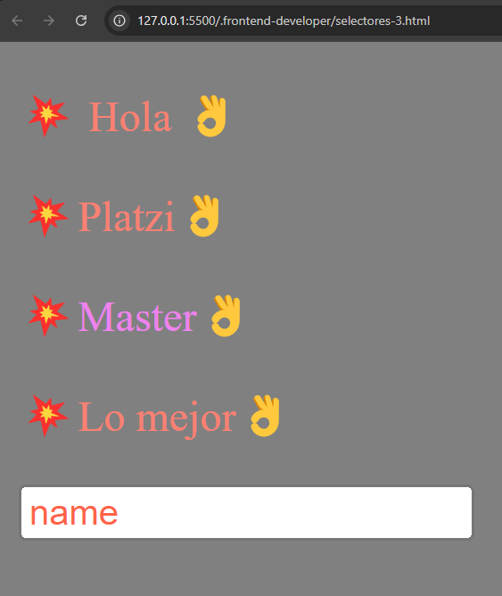

## 4. Selectores de pseudoclases y pseudoelementos.

<br>

| Pseudoclases | Pseudoelementos |
| :---: | :---: |
| :active | ::after |
| :focus | :: before
| :hover | :: first-letter |
| :nth-child(n) | ::placeholder |

### Pseudoclases.

Nos permiten llegar a actividades o acciones que hace el usuario, por ejemplo hacer clic o pasar el puntero sobre un botón o sobre un texto. Estos son solo algunos ejemplos, hay todavía muchos más. Se escriben con **dos puntos** `(:)` al principio del selector.

### Pseudoelementos.

Son aquellos elementos que no es posible llegar a ellos por medio de los selectores básicos y combinadores, como por ejemplo la primera letra de un texto o si queremos agregar contenido antes o despues de un texto, etc. Se escriben con  `(::)` al inicio del selector.

<br>

Maquetación con selectores de pseudoclases y pseudoelementos:

```html
<!DOCTYPE html>
<html lang="en">
<head>
    <meta charset="UTF-8">
    <meta name="viewport" content="width=device-width, initial-scale=1.0">
    <title>Document</title>
    <style>
        body {
            background: grey;
        }
        p {
            color: salmon;
        }
        p:hover {
            color: skyblue;
        }
        p:nth-child(2){
            color: violet;
        }
        p::first-letter{
            color: aquamarine;
        }
        p::before {
            content: "💥";
        }
        p::after{
            content: "👌";
        }
        ::placeholder {
            color: tomato;
        }
    </style>
</head>
<body>
    <p>
        Hola
    </p>
    <div>
        <p>Platzi</p>
        <p>Master</p>
        <p>Lo mejor</p>
    </div>
    <input type="text" placeholder="name">
</body>
</html>
```

<br>

En el navegador se vería asi:

