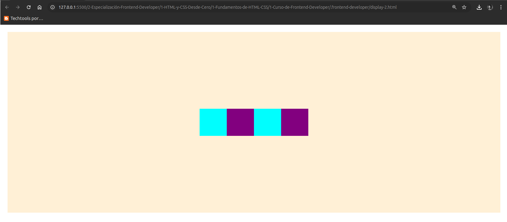

# Display en Caja (box) y en Maya (grid)


## Flexbox

Este módulo provee una forma más eficiente de disponer, alinear y distribuir el espacio sobre los objetos en un contenedor, incluso si su tamaño es desconocido y/o dinámico. 

Una guía muy util se encuentra en [CSS-Tricks](https://css-tricks.com/snippets/css/a-guide-to-flexbox/)

Nombramos el tag que contendrá lo que vamos a organizar, como `.container` y le damos el estilo de display `flex`

```css
.container {
    display: flex;
}
```

```html
<head>
    <meta charset="UTF-8">
    <meta name="viewport" content="width=device-width, initial-scale=1.0">
    <title>Document</title>
    <style>
        .container {
            display: flex;
        }
    </style>
</head>
<body>
    <div class="container">
        <div class="item"></div>
        <div class="item"></div>
        <div class="item"></div>
        <div class="item"></div>
    </div>
</body>
</html>

```

los items no llevan la propiedad flex a menos que también sean padres y tengan contenido en su interior.  
Veremos unos ejemplos:

Agregamos estilos a **.container** y agregamos **.item** para darle estilos también:

```css
.container{
    display: flex;
    background: papayawhip;
}
.item {
    width: 30px;
    height: 30px;
    background: purple;
}
```

Esto nos dará como resultado el siguiente layout:


Aquí los items están juntos sin tener espacio entre ellos, para poder darles espacio escribimos la siguiente propiedad:

```css
.container {
    display: flexbox;
    background: papayawhip;
    justify-content: space-between;
}
```
y obtendremos esto:


Para diferenciar nuestros elementos y centrarlos tanto en horizontal como en vertical hacemos lo siguiente:

```css
.container {
            display: flex;
            background: papayawhip;
            /* la propiedad de abajo centra los items desde un eje horizontal y
            de derecha a izquierda */
            justify-content: center;   
            /* aquí abajo la propiedad indica que alineará los items desde un eje vertical y de arriba hacia abajo */
            align-items: center;
            height: 200px;
        }
        .item{
            width: 30px;
            height: 30px;
            background: purple;

        }
        .container .item:nth-child(2n + 1){ /* aqui le estamos diciendo a 
        css que cambie el bckgnd de los items impares con el selector :nth-child(2n + 1) */
            background: cyan;
        }
```



Justificando de manera vertical con `flex-direction`:

```css
.container {
            display: flex;
            background: papayawhip;
            justify-content: center;   
            /* align-items: center; */
            height: 200px;
            /* Cambia el eje desde donde se justificarán los items, en este caso
            de manera vertical con el valor column */
            flex-direction: column;
        }
        .item{
            width: 30px;
            height: 30px;
            background: purple;

        }
        .container .item:nth-child(2n + 1){
            background: cyan;
        }
```


<br>

## CSSGrid

Es un sistema de disposición basado en maya de dos dimensiones.

[Guía completa de CSSGrid](https://css-tricks.com/snippets/css/complete-guide-grid/)

Grid funciona así, debemos darle el valor `grid` a la propiedad `display`:

```css
.container {
    display: grid;
    }
```

veamos los ejemplos:

```html
<head>
    <meta charset="UTF-8">
    <meta name="viewport" content="width=device-width, initial-scale=1.0">
    <title>Document</title>
    <style>
        .container {
            display: grid;
            width: 400px;
            height: 400px;
            background: lightgoldenrodyellow;
        } 
        .item {
            background: deepskyblue;
        }
    </style>
</head>
<body>
    <div class="container">
        <div class="item"></div>
        <div class="item"></div>
        <div class="item"></div>
        <div class="item"></div>
    </div>
</body>
```

Da como resultado lo siguiente, en donde por defecto, grid ordena el container de cierta forma:


Podemos darle el formato que nosotros deseamos con `grid-template-columns` y `grid-template-rows` asignandole 4 valores de 1fr (fr es una medida en la que designa una porción del espacio del contenedor):

```css
.container {
            display: grid;
            width: 400px;
            height: 400px;
            background: lightgoldenrodyellow;
            grid-template-columns: 1fr 1fr 1fr 1fr;
            grid-template-rows: 1fr 1fr 1fr 1fr;
        } 
        .item {
            background: deepskyblue;
        }
```

Obtendremos esto:


Para poder poner los items dispuestos en diagonal, podemos hacer lo siguiente:

```css
.container {
            display: grid;
            width: 400px;
            height: 400px;
            background: lightgoldenrodyellow;
            grid-template-columns: 1fr 1fr 1fr 1fr;
            grid-template-rows: 1fr 1fr 1fr 1fr;
        } 
        .item {
            background: deepskyblue;
        }
        .container .item:nth-child(1){
            grid-column: 1 / 2;
        }
        .container .item:nth-child(2){
            grid-column: 2 / 3;
            grid-row: 2 / 3;
        }
        .container .item:nth-child(3){
            grid-column: 3 / 4;
            grid-row: 3 / 4;
        }
        .container .item:nth-child(4){
            grid-column: 4 / 5;
            grid-row: 4 / 5;
        }
```

