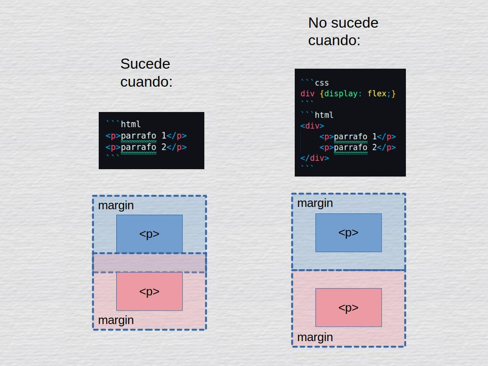
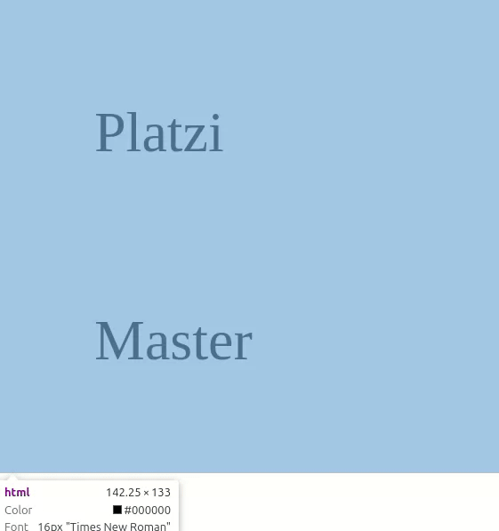

# Colapso de márgenes

En la clase anterior vimos que los bloques div alineados uno debajo del otro compartían sus margenes superior e inferior respectivamente, esto es siempre así con elementos tipo bloque. 

Esto no sucede cuanto tenemos elementos que no sean bloque o que tengan un display de flexbox o grid.

<br>



<br>

Nuestro código quedaría de la siguiente forma:

```html
<head>
    <meta charset="UTF-8">
    <meta name="viewport" content="width=device-width, initial-scale=1.0">
    <title>Document</title>
    <style>
        .container {
        display: flex;
        flex-direction: column;
        }
        div {
            margin: 20px brown;
        }
    </style>
</head>
<body>
    <section class="container">
        <div>Platzi</div>
        <div>Master</div>
    </section>
</body>
</html>
```

<br>

Y se veria de la siguiente forma

