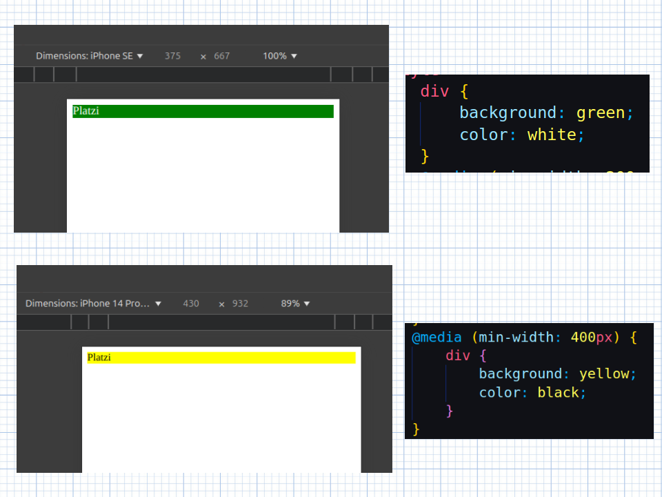

# Diseño responsivo.

El diseño responsivo nos ayuda a habilitar nuestro sitio web para que pueda ser visto desde cualquier tipo de resolución de pantalla, desde un smart tv hasta un celular de 4.5 pulgadas.  
Podemos cambiar tanto tamaños, estilos, fuentes, colores etc, como el tipo de vista que tienen, dependiendo el tipo de pantalla que le indiquemos.

Para indicar los cambios debemos utilizar el selector `@media`

<br>

En este ejemplo tenemos un div que cambiará de color dependiendo el tamaño de la resoluciuión:

```html
<head>
    <style>
        div {
            background: green;
            color: white;
        }
        @media (min-width: 400px) {
            div {
                background: yellow;
                color: black;
            }
        }
    </style>
</head>
<body>
    <div>
        Platzi
    </div>
</body>
</html>
```

<br>

El div normalmente se muestra con fondo verde y letra color blanco.  
Pero al momento de aplicarle el diseño responsivo, estamos declarando que a partir de 400px hacia arriba el div se mostrará de color amarillo con letra de color negro.



si cambiamos el `min-width` por `max-width` en el selector `@media` el resultado será a la inversa.

