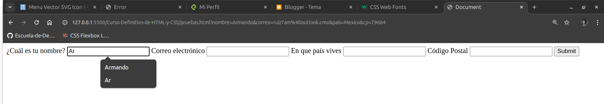

# Formularios

Son la primera forma de interacción con los usuarios, con ellos se recopila información que necesitamos para realizar la tarea dada al sitio, ya sea que tengamos una tienda virtual, una sitio de reserva de hoteles o viajes, suscripciones, etc.

Los formularios pueden ser tediosos, si no logramos optimizar su uso, puede ser un factor determinante en la captación de usuarios, ya que si son demasiado complejos pueden generar una mala experiencia para estos mismos.

Hay una frase que versa:

> "El mejor formulario es el que no existe"

Pero eso a veces es imposible, para poder recopilar cierta información hay que utilizarlos.

<br>

## Semántica y Optimización

Para comenzar a hacer formularios de manera optima, comenzaremos viendo cual no sería una buena forma de hacerlos:

**Así no hay que hacerlo**
```html
<div>
        <input type="text" >
</div>
```

Esto ya no es una buena práctica, la forma correcta de hacerlo es con la etiqueta form, para darle semántica:

**Asi hay que hacerlo**
```html
<form>
        <label for="">
                <span></span>
                <input type="text">
        </label>
</form>
```

<br>

En la pantalla los dos se ven exactamente igual, pero a la hora de utilizar la semántica para el acomodo del sitio se nos dificultará hacerlo

<br>


<br>

```html
 <form action="">
        <label for="nombre"> 
            <span>¿Cuál es tu nombre?</span>
            <input type="text" id="nombre"> <!-- le ponemos atributo id el mismo que
            el four de label-->
        </label>
        <label for="inicio-platzi"> 
            <span>¿Qué dia iniciaste en platzi</span>
            <input type="date" id="inicio-platzi"> <!-- le ponemos atributo id el mismo que
            el four de label-->
        </label>
        <label for="horario"> 
            <span>¿En que Horario estudias?</span>
            <input type="time" id="horario"> <!-- le ponemos atributo id el mismo que
            el four de label-->
        </label>
    </form>
```

**Placeholder**: Pone un ejemplo de lo que el usuario debe de ingresar en el input.

```html
<label for="nombre"> 
            <span>¿Cuál es tu nombre?</span>
            <input type="text" id="nombre" placeholder="Nombre"> <!-- le ponemos atributo id el mismo que
            el four de label-->
</label>
```


<br>

**Formulario para check in de viaje**

Esto es un ejemplo de optimización en el que de cuatro inputs lo reducimos a un formulario.

<br>

check in con cuatro inputs
```html
<form action="">
        <label for="hora">
            <span>Hora</span>
            <input type="time" id="hora" name="hola">
        </label>
        <label for="dia">
            <span>Día</span>
            <input type="date" id="dia" name="dia">
        </label>
        <label for="semana">
            <span>Semana</span>
            <input type="week" id="semana" name="semana">
        </label>
        <label for="mes">
            <span>Mes</span>
            <input type="month" id="mes" name="mes">
        </label>
        <input type="submit">
    </form>
```


<br>

check in con un inputs
```html
<form action="">
        <label for="calendario">
            <span>Calendario</span>
            <input type="datetime-local" id="calendario" name="calendario">
        </label>
    </form>
```

<br>


<br>

## Autocomplete y Required

### Autocompletar

<br>

```html
<form action="">
            <label for="nombre">
                <span>¿Cuál es tu nombre?</span>
                <input type="text" name="nombre" id="nombre" autocomplete="name" />
            </label>
            <label for="correo">
                <span>Correo electrónico</span>
                <input type="email" name="correo" id="correo" autocomplete="email" />
            </label>
            <label for="|">
                <span>En que país vives</span>
                <input type="text" name="pais" id="pais" autocomplete="country" />
            </label>
            <label for="cp">
                <span>Código Postal</span>
                <input type="text" name="cp" id="cp" autocomplete="postal-code" />
            </label>
            <input type="submit">
        </form>
```

<br>



<br>

### Required

<br>

```html
<label for="nombre">
                <span>¿Cuál es tu nombre?</span>
                <input type="text" name="nombre" id="nombre" autocomplete="name" required />
            </label>
            <label for="correo">
```

<br>


## Formulario con opciones


Para proporcionar opciones y hacer mas fácil la experiencia del usuario, utilizamos la etiqueta select y datalist, pero aquí también hay practicas considerada "malas", ya que dependiendo el uso que se vaya a dar se pueden utilizar una u otra, la siguiente es la forma en la que **NO** se debe de hacer en listas de opciones demasiado largas, ya que se crea solamente una lista y no da opción de buscar lo que queremos seleccionar.

<br>

```html
<main>
        <form action="">
            <select name="cursos" id="">
                <option value="HTML5">HTML5</option>
                <option value="CSS3">CSS3</option>
                <option value="JavaScript">JavaScript</option>
                <option value="Web Standards">Web Standards</option>
            </select>
        </form>
    </main>
```

<br>

Una forma mas optimizada sería:

<br>

Aquí se crea un input con las opciones, la cual es la diferencia de la anterior, que es solo una lista en donde hay que buscar dando scroll, mientras que en ésta está la opción de escribir para buscar, lo cual agiliza la selección.
```html
<input list="cursos"> <!-- List de input y id de datalist deben ser el mismo-->
    <datalist id="cursos">
        <option value="JavaScript"></option>
        <option value="HTML5"></option>
        <option value="CSS3"></option>
        <option value="Web Standards"></option>
    </datalist>
```

<br> 

Los casos anteriores dependen mucho de si se utilizaran para listas de opciones largas y cortas

## Input type submit vs Button

<br>

- `Input type="submit`: se utiliza más para el envío de formularios, 
- `Button`: tiene un propósito mas general porque se puede estilizar mejor.

<br>

```html
<input type="submit" value="Nombre">
    <button type="submit">¿Que color te gusta?</button>
```

<br>


<br>

Pasaremos a CSS pero antes una infografía de cheat sheet de los tags html:

<br>

