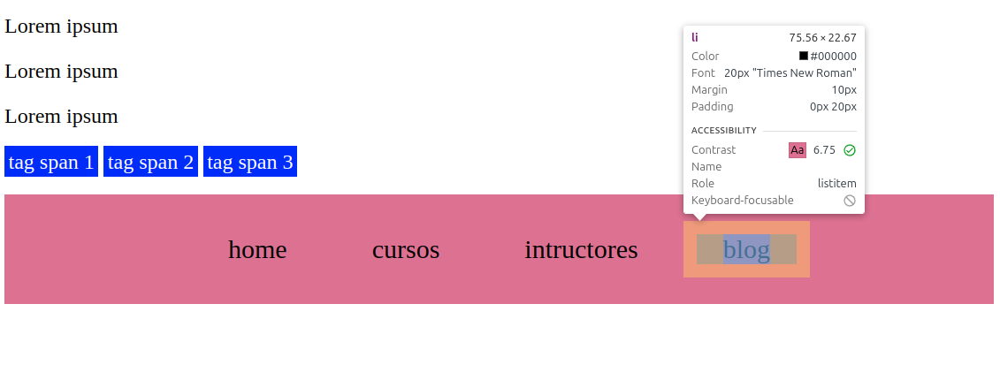

# Display
Es la forma en la que seran acomodados los elementos en relación con el modelo de caja. Existen varios valores de la propiedad, pero los básicos y con el que las etiquetas vienen por defecto son:

- Block
- Inline
- Inline-block

<br>

## Block
El display block ocupa todo el ancho de pantalla
```css
.block-element {
    background: green;
    margin: 10px;
    padding: 20px;
}
```
```html
<div class="block-element">Esta es una etiqueta div</div>
<p class="block-element">Esta es una  etiqueta de parrafo</p>
<div>
    <p class="parrafo">Lorem ipsum</p>
    <p class="parrafo">Lorem ipsum</p>
    <p class="parrafo">Lorem ipsum</p>
</div>
```


Como podemos ver aquí los tags div y p son elementos block por defecto, quiere decir que, aunque su contenido no alcance a cubrir el 100% de la pantalla, la caja del tag si lo mantendrá.

<br>

## Inline
El display inline ocupa el ancho solo del contenido del tag al que se le aplicó.
```css
.block-element {
    background: green;
    margin: 10px;
    padding: 20px;
}
span {
    background-color: blue;
    color: white;
    padding: 3px;
}
```
```html
<div class="block-element">Esta es una etiqueta div</div>
<p class="block-element">Esta es una  etiqueta de parrafo</p>
<div>
    <p class="parrafo">Lorem ipsum</p>
    <p class="parrafo">Lorem ipsum</p>
    <p class="parrafo">Lorem ipsum</p>
</div>
<span>tag span 1</span>
<span>tag span 2</span>
<span>tag span 3</span>
```

Los elementos con propiedad inline se acomodan de izquierda a derecha, dependiendo del espacio que haya en esa misma línea, a parte de esta diferencia con los elementos con propiedad block, estos no se puede modificar su width ni su height ni tampoco agregar margin ni padding.

<br>

## Inline-block
Este valor es una combinación de los dos anteriores, de manera concreta, es disponer de un bloque con sus caracteristicas de estilización (manipulación de ancho, alto, margen interno y externo) pero con la particularidad que define a los elementos inline, que son capaces de mantener su ancho ajustado a su contenido.

```css
.nav {
    background-color: palevioletred;
    padding: 20px;
    list-style: none;
    text-align: center;
}
.nav li {
    display: inline-block; /* Fusion de lo mejor de los dos valores*/
    font-size: 20px;
    margin: 10px;
    padding-left: 20px;
    padding-right: 20px;
}
```
```html
<ul class="nav">
      <li>home</li>
      <li>cursos</li>
      <li>intructores</li>
      <li>blog</li>
</ul>
```

