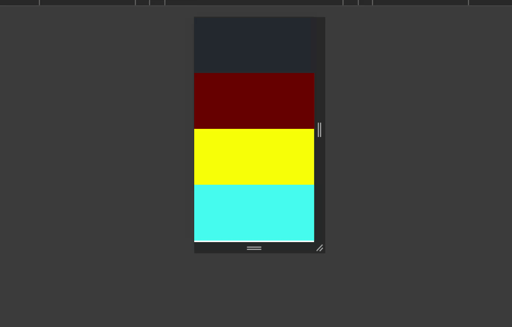
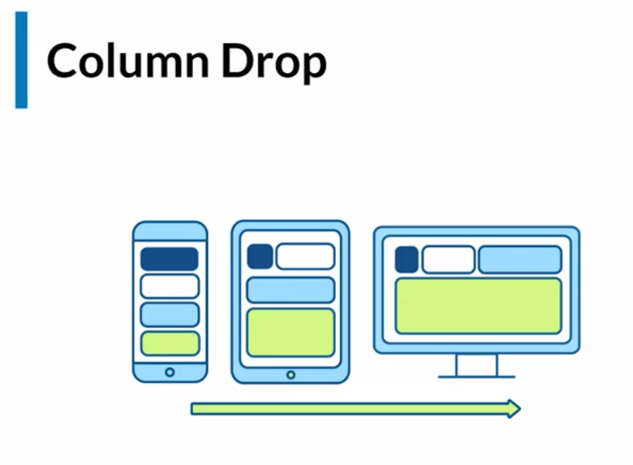

# Patrones de maquetación Responsive Design
Los patrones de diseño en maquetación para responsive, se adaptan según el tipo de layout que queramos mostrar al usuario. Existen tres mas comúnmente utilizados:

- Mostly Fluid
- Layout Shifter
- Column Drop

 

## Mostly fluid
Inicia con columnas en dispositivos móviles, conforme va creciendo la pantalla, se re-acomodan esas columnas.

 

## Layout Shifter

Este tipo de patrón tiene ciertos contenedores padres que se van a re-posicionar con mas contenedores adentro. El layout puede cambiar de manera "desordenada" siguiendo un patron que nos permita re-acomodar lo mejor posible.

 

## Column Drop

Aquí las columnas son arrojadas una por una y acomodadas de izquierda a derecha, el layout va siguiendo el mismo flujo de elementos pero ya no de manera vertical sino horizontal.

