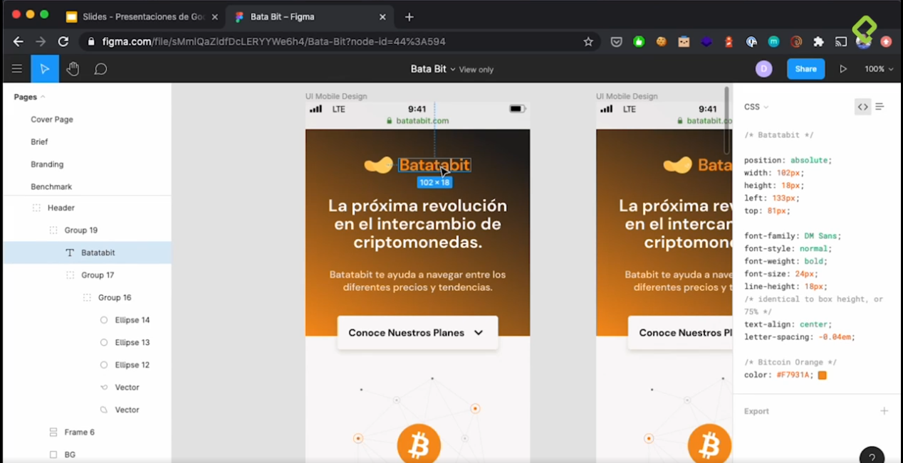

# Responsive Design: Maquetación Mobile First

Hoy en día desarrollar contenido web para dispositivos móviles ya no es una opción o diseñarlo como una alternativa, el desarrollo web para móviles se ha convertido en un estándar, tanto que, ahora se diseña primero para moviles, comenzando con smartphones de pantalla chica y despues se escala para dispositivos de mayor tamaño como smartphones de mayor tamaño de pantalla, tablets, laptops, y desktops. En este curso aprenderemos a maquetar y desarrollar el sitio web de una empresa real.

 

## Figma

Es una aplicación web de diseño que, en nuestro caso, nos servirá para diseñar el proyecto, o en su defecto, se nos sera enviado por algun diseñador.

 

## Analizando el diseño.

El proyecto tiene:
- Header
- 4 secciones
- Footer

Figma construye estilos en css, que se pueden tomar como referencia.

