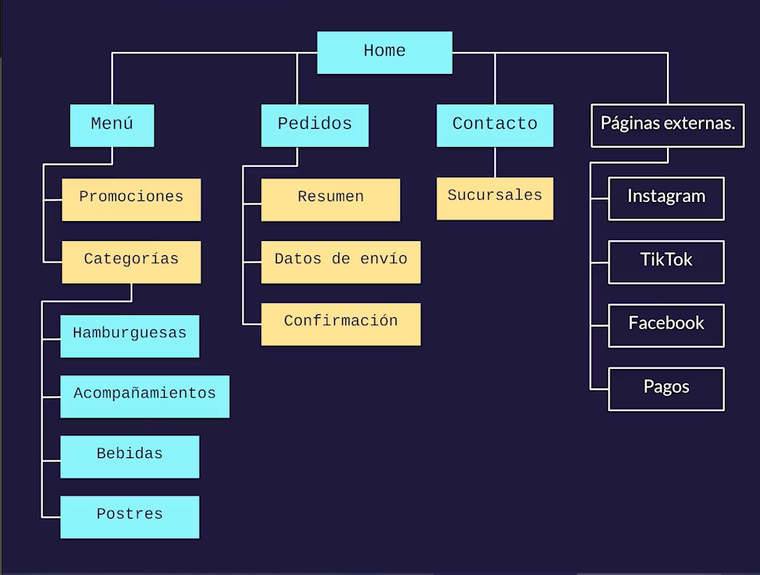
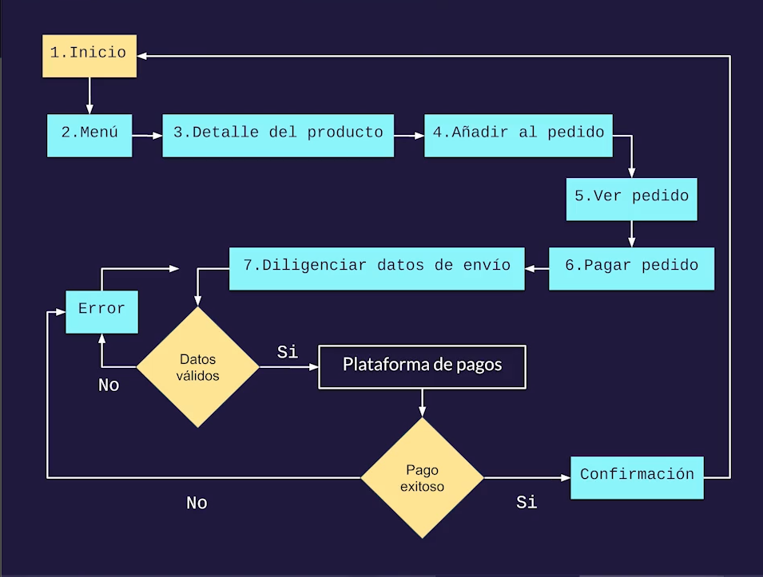

# Diagramas de flujo

Con los diagramas de flujo se traducen los requerimientos de nuestro brief a elementos tangibles.

 

Objetivo | Requerimiento 
:---: | :---:
Dar a conocer sus productos | Menú y promociones
Aumentar la presencia en línea | Redes Sociales
Hacer pedidos online | Pedidos 
Dar a conocer la marca | Contacto y sucursales

 

Diagrama de flujo:

 

 

## Flujo de Usuario (User flow)
Son mas complejos pero nos permiten hacer un diagrama general de todos los pasos que tiene que hacer un usuario para completar una tarea.

 

