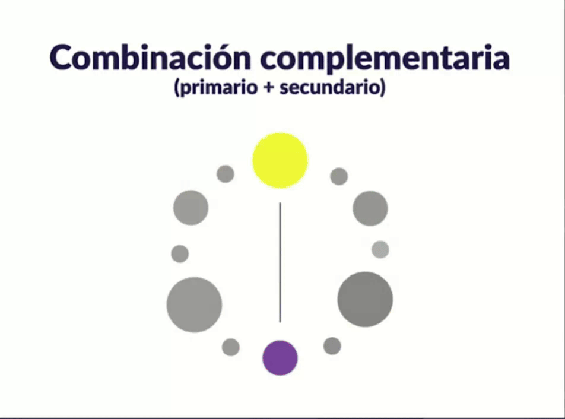
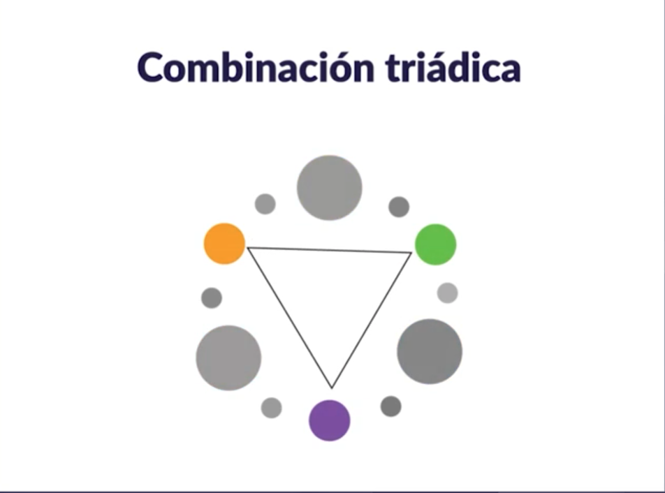
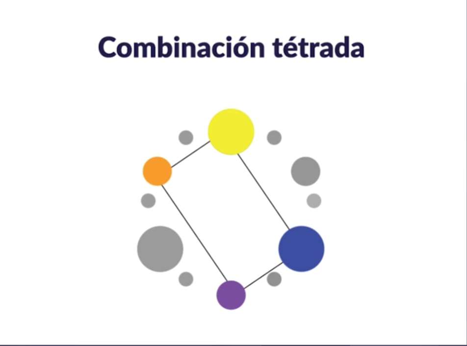

# Teoría del color

Uno de los conceptos mas importantes y que hay que tener muy claros dentro de la teoría del color es la psicología del color.

## Psicología del color
Es una area de estudio que investiga la forma en la que el cerebro percibe los colores y los asocia con diferentes conceptos. Muchas marcas hacen uso de esto para posicionarse en el mercado.

 

Por ejemplo, aquí tenemos algunos colores y la asociación mas común de emociones, sentimientos o conceptos  que hace el cerebro con cada uno de ellos:

 

## Colores para web
- Utiliza color RGB y hexadecimales.
- crea un código de color consistente.
- Menos es más. El exceso de color hace que los usuarios no se puedan enfocar en una acción a la vez.
- Asegúrate de que tu elección de color sea accesible.
- Define una paleta de color.

 

## Paleta de color
Aquí vamos a construir la paleta de color para nuestra aplicación. Para construirla debemos de tener claro los tipos de colores que existen. 

 

### Tipos de colores
- **Primarios**: Rojo, azul y amarillo
- **Secundarios**: son el resultado de la combinación de los colores primarios: Naranja, verde y morado.
- **Terciarios**: Son los que se encuentran en el circulo cromático entre un color primario y un color primario. son las transiciones entre estos dos.

 

### Tipos de Paletas
También existen diferentes tipos de paletas de color:

- **Combinación monocromática**: Es escoger un color y sus diferencias de opacidad.

 

- **Combinación análoga**: consiste en combinar un color primario, con uno secundario y uno terciario.

 

- **Combinación complementaria**: es la combinación de un color primario y un color secundario. Estos colores están opuestos en el circulo cromático y se pueden encontrar en cualquier gráfica de circulo cromático.

 

- **Combinación Triádica**: Consiste en crear un trinagulo en el centro del circulo cromático.

 

- **Combinación Tétrada**: Esta ultima consiste en combinar cuatro colores, 2 primarios y 2 secundarios, creando un rectangulo en el centro del circulo cromático.

