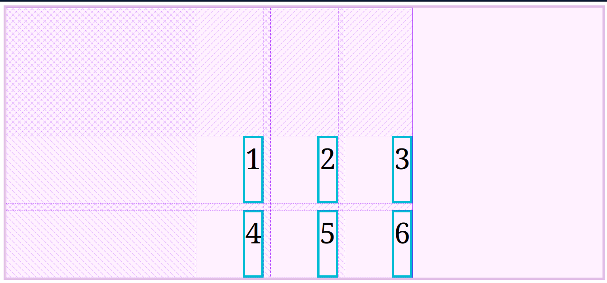

# Propiedades de Alineación

Sirven para alinear los items o elementos y la grilla en el espacio en el que estan viviendo.

En las propiedades, ya sean del grid container o del item, veremos las palabras: **justify**, **align** y **place**.

Cada una tiene una dirección de alineación:

- **Justify**: alinea de manera horizontal
- **Align**: alineacion de manera vertical
- **Place**: alineacion de manera vertical y horizontal

<br>

### Propiedades de alineación de los items (en contenedor)
estas propiedades son las que declaramos en el contenedor y nos ayudan a alinear todos los items que existen dentro de ese contenedor.

- **Justify-items**
- **Align-items**
- **Place-items**

<br>

```css
.container {
    justify-items: end;
    align-items: start;
}
```



<br>

### Propiedades de alineación del contenedor
Estas propieades ajustan la grilla completa en el espacio en donde vive. No tiene nada que ver con sus elementos hijos, sin es la grilla misma alineandose como un bloque.

- **Justify-content**
- **Align-content**
- **Place-content**

<br>

```css
.container {
    justify-content: center;
    align-content: center;
}
```
```css
.container {
    place-content: center;
}
```

Estas dos declaraciones dan el mismo resultado:


<br>

```css
.container {
    justify-content: center;
    align-content: end;
}
```

Aquí alineamos el contenedor al centro de manera horizontal y al final de manera vertical.


<br>
<br>

### Propiedades de alineación de los items (en el item directamente)
Se dan directamente a los hijos de la grilla o grid items

- **Justify-self**
- **Align-self**
- **Place-self**

<br>

```css
.item:nth-child(2) {
    justify-self: start;
    align-self: end;
}
```

Aqui alineamos solo el item 2, al principio de manera horizontal y al final de manera vertical

