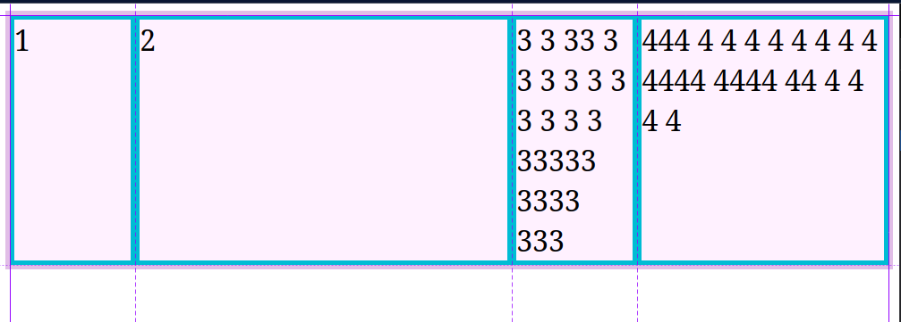

# Keywords especiales en grid

- **fr**: es una nueva unidad que se usa en css grid para darle alto o ancho a las columnas, se refiere a la fraccion que una columna que va a tomar del total del layout.

```css
.contenedor {
    grid-template-columns: 1fr 3fr 1fr 2fr;
}
```



<br>
<br>

- **min-content**: ajusta el ancho de la celda lo minimo sin romper el contenido.

```css
.contenedor {
    grid-template-columns: 1fr 3fr min-content 2fr;
}
```


<br>
<br>

- **max-content**: ajusta el ancho de la celda lo maximo que pueda para que el contenido pueda verse lo mas ancho posible.

```css
.contenedor {
    grid-template-columns: 1fr 3fr max-content 2fr;
}
```


<br>
<br>

- **auto-fill/auto-fit**: esto nos ayuda a que la grilla ocupe el 100% del espacio que tiene disponible. Auto fill agrega columnas invisibles, y auto fit ensancha las columnas existentes para que ocupen el 100%.

```css
.contenedor {
    grid-template-columns: repeat(auto-fit, minmax(100px, 1fr));
}
.contenedor-2 {
    grid-template-columns: repeat(auto-fill, minmax(100px, 1fr));
}
```

