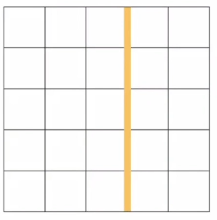
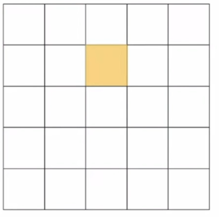
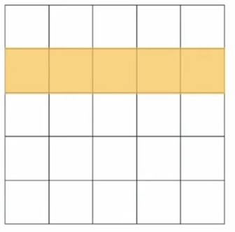
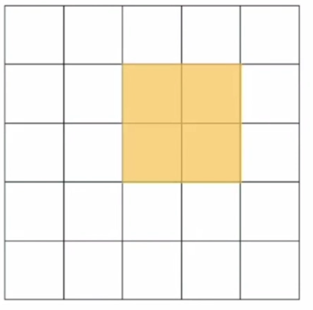
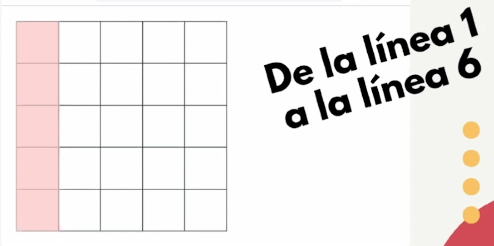
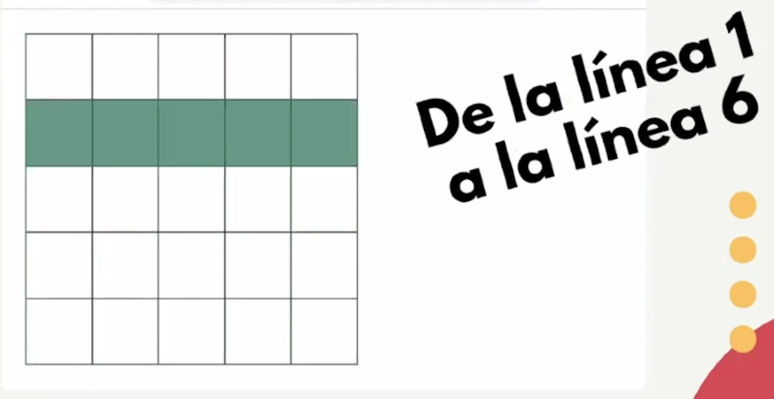

# Conceptos generales para comenzar a trabajar con CSS Grid.

Para empezar a trabajar con Grid es necesario tener muy presente las relaciones que existen entre Padre e hijos.

Grid es crear una rejilla padre, denominada tambien contenedor (container) que tenga filas y columnas, las cuales, a su vez crean celdas que son consideradas como los hijos de ese contenedor, llamados también objetos (items), los hijos también pueden convertirse en padres al alojar items en su interior.

```html
<div class="container">
    <div class="item sub-container">
        <div class="sub-item"></div>
        <div class="sub-item"></div>
    </div>
    <div class="item"></div>
    <div class="item"></div>
</div>
```

Para hacer uso de CSS Grid y o darle un acomodo a ciertos elementos, el padre de esos elementos siempre deben tener la propiedad display con el valor grid.

<br>
<br>

## Lines, tracks, area y cell

Padre | hijos
:---: | :---:
Lines | cell
Track | 
area | 

### Lines

Son las lineas que dividen cada una de las filas y columnas.
la interseccion de 2 lineas horizontales con 2 verticales forman una celda



### Cells

Son las intersecciones entre las filas y las columnas, es la unidad mínima de las Grid



### Track

Es un conjunto de celdas en una misma fila o columna.



### Area

Un area es un conjunto de celdas que pueden ocupar varias filas y columnas.



<br>
<br>

## Gutters, grid axis, grid row y grid column

Padre | hijos
:---: | :---:
Gutters | Grid row
Grid axis | Grid column
| | grid axis

### Gutters
Son los espacios entre cada una de las columnas y filas


### Grid row

Sabemos que las filas son horizontales, van de izquierda a derecha, y que las columnas son verticales, van de arriba hacia abajo, pero para los conceptos de grid row|column los veremos de otra forma, lo que se pretende es hacer un conteo de las lineas, entonces el grid row hacer referencia al inicio de cada una de las filas, entonces en vez de verlo horizontalemente lo veremos de manera vertical.

Esta es una fila, pero grid row no hace referencia a esto:


<br>

Grid row hace referencia a esto:



<br>

### Grid column
En el caso de grid column sería lo mismo que grid row pero a la inversa.


<br>



<br>
<br>

## Grid axis
esta propiedad es para temas de alineación.

### row axis
Es el eje horizontal (x), también denominado inline axis.


### column axis
Es el eje vertical (y), también conocido como block axis.

