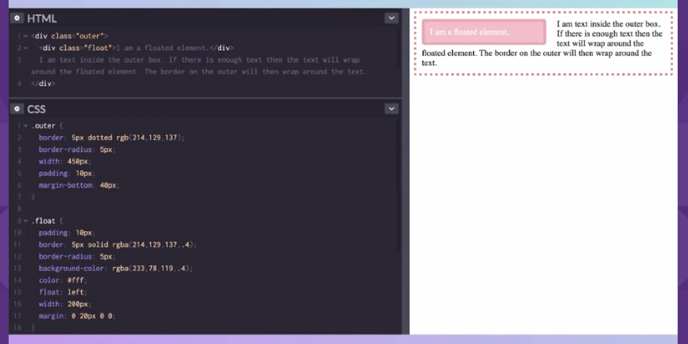
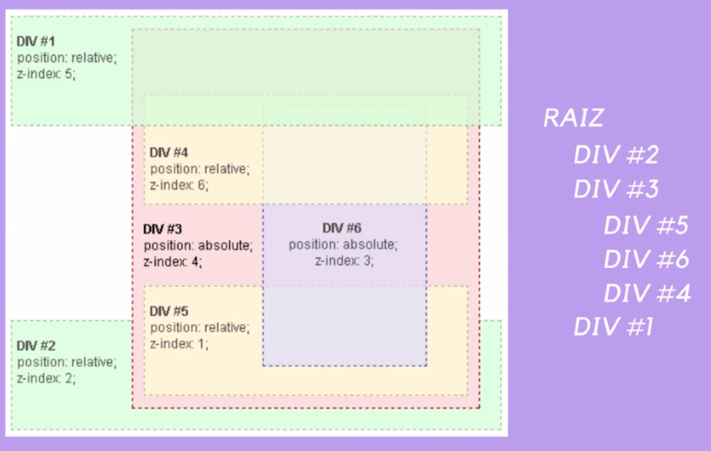
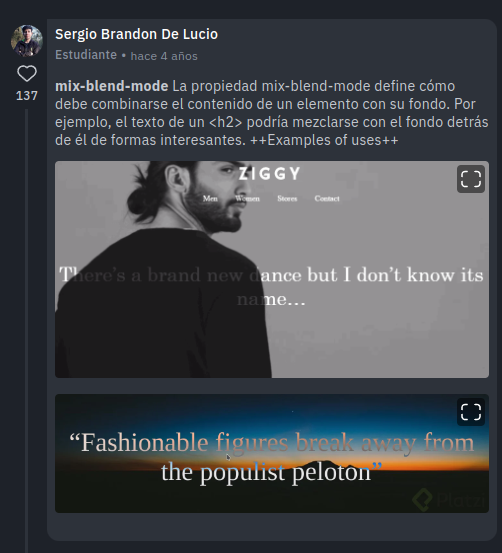

# Conceptos que forman parte del diseño en CSS

En el Curso de CSS Grid Layout vimos algunas herramientas que nos han facilitado el camino como desarrolladores a lo largo de todos estos años y hablamos de que independientemente de cómo creemos nuestros sitios web a futuro, es importante que veamos el potencial que tiene CSS en este momento, como también que aumentemos nuestra comprensión del por qué suceden ciertas cosas.

Dando una pequeña continuación a esas herramientas que nos han facilitado el camino y especialmente a los “trucos” que tanto diseñadores como desarrolladores web han creado de forma ingeniosa a lo largo del tiempo, quiero que revisemos en este módulo algunos conceptos de CSS que son fundamentales para comprender a profundidad todo lo relacionado al diseño con CSS.

El objetivo al revisar los conceptos de display block e inline, contextos de formato, y posicionamiento en este módulo; es que revisemos todo el panorama, que tengamos una visión amplia del diseño con CSS, que ampliemos o reforcemos nuestros conocimientos base, y también, que veamos el impacto que estos conceptos tienen en la forma en la que diseñamos hoy en día.

 

## Flujo normal del documento

> "Display:  
> verb; desplegar, colocar a la vista, exhibir, lucir, mostrar, presentar"

En el contexto de las propiedades en CSS, display es definir el tipo de visualización de un elemento. Cuando trabajamos con display, nos centramos más en los valores y no en la propiedad por si sola.

### Elementos Block e Inline
El comportamiento de los elementos en bloque y en línea es fundamental para CSS y el hecho de que un documento HTML marcado correctamente será legible por defecto. Este diseño se conoce como ***Diseño de bloque y en línea*** o ***Flujo normal***, porque ésta es la forma en que los elementos se presentan si no aplicamos estilos directamente.  
Estos valores de display definen los valores interno y externo de visualización.  

**Inline**  
Son como palabras en una oración, se separan por medio de un espacio en blanco entre ellos.

**Block**  
Se extienden ocupando todo el espacio disponible para ellos.

Estos valores de display definen los valores interno y externo de visualización.  

Un elemento que tenga todos los atributos de bloque puede darle:

- ancho
- alto
- padding
- margin

y estirarse en todo el espacio, sin embargo, a los hijos de un contenedor grid, se les ha dado un valor interno de grid

Esta forma de pensar el display es realmente útil, si vemos el valor `display: inline-flex` inmediatamente pensaremos que se comporta como un elemento en línea, pero por dentro lso hijos tendrán esa característica flexible.

Siempre vamos a volver al flujo normal del documento después de agregarle una propiedad display a algún elemento

Al trabajar de esta forma obtendremos:

- Flujo mas agradable y legible.
- CSS mucho más fácil.
- Menos probabilidad de tener problemas de accesibilidad (ya que está trabajando con el orden de los documentos, que es exactamente lo que está haciendo un lector de pantalla o una persona que revisa el documento)

 

 

Existe otra propiedad display básica que combina las dos anteriores: `inline-block`, que mezcla lo mejor de ambas propiedades, pero para comprenderla mejor, tenemos que entender otro concepto muy importante, el **BFC**.

 

## BFC (Block Formatting Context)
Del inglés, Contexto de formato de bloque, es un pequeño layout dentro del layout principal.

En palabras más técnicas, es una parte del renderizado visual de una pagina web. Es la región en donde ocurre la disposición de las cajas en bloque y en donde los elementos flotantes interactúan con otros elementos.

 

Un Contexto de formato de bloque es creado al menos por uno de los siguientes:

- El elemento root del documento (tag html)
- Floats o elementos flotantes (elementos en donde la propiedad float es diferente de none)
- Elementos con posiciones absolutas (con position: absolute o fixed)
- Elementos inline-block
- Celdas de tablas o elementos con display: table-cell
- Pies de tabla o elementos con display: table-caption
- Celdas de tablas anonimas creadas implicitamente por elementos con el display: table
- Elementos en bloque con la propiedad overflow diferente de visible o clip
- Elementos con display: flow-root
- elementos button e inputs tipo botón con display por default flow-root
- Elementos con contain: layout, content o paint
- Objetos flex (hijos directos del elemento con display: flex o inline-flex)
- Objetos Grid (hijos directos del elemento con display: grid o inline-grid)
- Contenedores multi-columnas (elementos donde column-count o column-width no son auto, incluyendo elementos con column-count: 1).
- Elementos con column-span: all, incluso cuando el elemento no esta contenido en un contenedor multi-columna.

 

Los contextos de formato afectan el layout porque un elemento que establece un nuevo BFC:

- Contendrá elementos flotantes dentro
- Excluye elementos flotantes externos
- Suprime el colapso de margenes

 

 

## Posicionamiento

En html y css la representación de los elementos es mediante cuadros o *"cajas"* (de ahí el box model) los cuales tienen una propiedad implícita desde el momento de ser creados y que podemos controlar posteriormente, la cual hemos estado estudiando y es display.

Este modelo de caja y propiedad de display nos van a permitir posicionar los objetos de diferentes maneras:

- Arriba
- Uno al lado de otro
- Uno encima del otro

Este último nos abre camino a un nuevo concepto: **El contexto de apilamiento**

### Contexto de apilamiento

Es la conceptualización tridimencional de los elementos HTML a lo largo de un eje Z imaginario relativo al usuario, que se asuma esta de cara al viewport, pagina web o pantalla. Los elementos HTML ocupan este espacio por orden de prioridad basado en sus atributos.

 

 

Un contexto de apilamiento es formado, en cualquier lugar del documento, por cualquier elemento que:

- Elemento root (tag html)
- Tenga posición absoluta o relativa con un valor z-index distinto de auto
- Tenga position: fixed
- Si un elemento flex con un valor z-index, distinto de auto, que sea el elemento padre display: flex | inline-flex
- Sean elementos con un valor opacity menor de 1
- Elemento con un valor transform distinto de none
- Elementos con un valor mix-blend-mode distinto de normal
- Elementos con un valor filter distinto de none
- Elementos con un valor perspective distinto de none
- Elementos con un valor isolation igual isolate
- Especifican cualquier atributo superior en will-change incluso si no especificas valores para estos atributos directamente
- Elementos con un valor -webkit-overflow-scrolling igual a touch

 
 

#### mix-blend-mode

