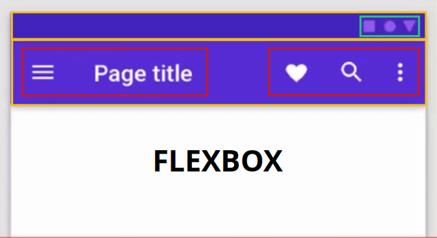

# ¿Flexbox o CSS Grid?

### Fexblox
Es un método que puede ayudar a distribuir el espacio entre los ítems de una interfaz y mejorar las capacidades de alineación.  
Una característica importante a tomar en cuenta es que es un sistema **unidireccional**, esto quiere decir que nos permitirá alinear de forma horizontal o vertical.

 

**Propiedades flexbox**
**Container** | **Items**
:---: | :---:
display | order
flex-direction | flex-grow
flex-wrap | flex-shrink
flex-flow | flex-basis
justify-content | flex
align-items | align-self
align-content |

 

### CSS Grid
Es un sistema de diseño que permite al autor alinear elementos en columnas y filas y es un sistema **bidireccional** que nos permite alinear horizontal y verticalmente.

 

**Propiedades CSS Grid**
**Container** | **Items**
:---: | :---: 
display | grid-column
grid-template | grid-row
gap | grid-area
justify-items | justify-self
align-items | align-self
justify-content | 
align-content |

 

## Similitudes entre Flexbox y CSS Grid

En general tenemos dos similitudes:

- Relaciones entre containers e items (padres e hijos directos), en donde los items también pueden ser containers y también en los dos (css grid y flexbox) las propiedades se dividen en dos, uno para container y otro para items
- Ejes de alineamiento: inline y block, u horizontal y vertical.

 

**¿Se puede trabajar con flexbox y CSS Grid al mismo tiempo?**

Claro que sí, pero va a depender de lo que necesitemos, del diseño que tengamos y de lo que queramos.

Desde mi punto de vista, y hasta ahora después de haber tomado varios cursos de la ruta de frontend, CSS Grid, es preferible para un layout bastante amplio y que contiene secciones que tendrán mas elementos dentro, y flexbox, para elementos mas específicos.

 
 

## Dinamica.

Se mostrarán varios componentes web y decidiremos que usar, si flexbox o css grid.

1. [App bar: top](https://material.io/compnents)

 

 

**Mi respuesta**: Usaría flexbox, con un direction block, dividiria el area de notificaciones y la barra de navegacion en dos divs, uno en cada uno y tambien con flex cada uno de ellos, con esto podria alinear los items.

 
 

## ¿Cuándo utilizar flexbox y cuándo CSS Grid?

**Flexbox** es más apropiado para los componentes de una aplicación y diseños de pequeña escala.  
**CSS Grid** es más apto para diseños de mayor escala