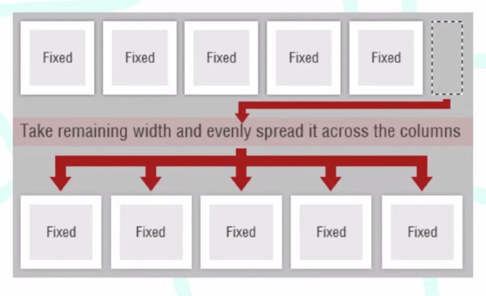
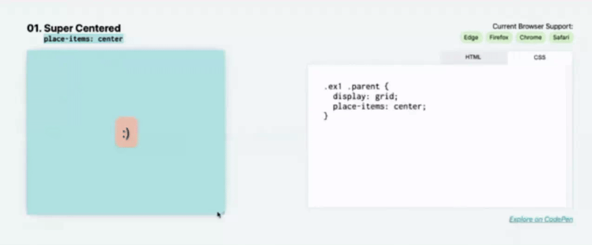
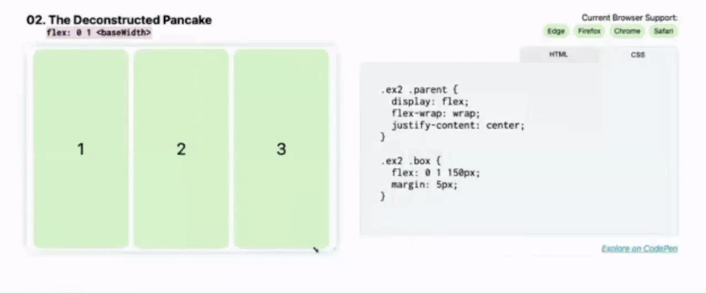
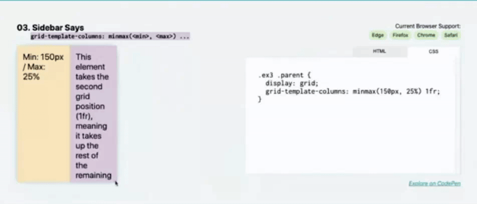
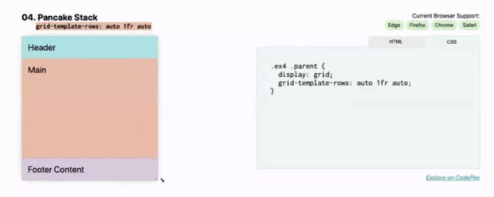

# Modern Layouts con CSS Grid

### ¿Qué son los modern layouts?

1. Del inglés, disposición o diseño.
2. Colocar tus cajas en el lugar que lijas con respecto a la ventana principal y el resto de cajas.

### ¿Por qué es modern?
Son características establecidas en 2010 (época en la cual ya utilizaban HTML5 y CSS3):
- Progresivamente mejorado
- Adaptable a diversos usuarios
- Modulares y eficientes
- Tipograficamente ricos

 

## Progresivamente mejorado
Tener una base sólida e ir añadiendo estilos complejos para aquellos navegadores que pudieran soportarlo.

Esta base sólida se construye a partir de capas: CSS, HTML y JS.

 

 

## Adaptable a diversos usuarios

Que fuera compatible con:
- La amplia gama de navegadores
- Dispositivos
- Resoluciones de pantalla
- Tamaños de fuente
- Tecnologías de asistencia

Se hablaba de columnas inteligentes con CSS y JQuery:

 

 

## Modulares y eficientes
Que el CSS se pueda dividir en fragmentos que funcionan de forma independiente para crear componentes de diseño que se puedan reutilizar de forma independiente.

Se hablaba de un framework que permitiera a los desarrolladores escribir código front-end modular rápido, fácil de mantener y basado en estándares.

 

## Tipograficamente rico.
Se explica solo, que tenga gran variedad de tipografías.

 
 

## Layouts

### Super Centered
`place-items: center;`

 

### The deconstructed Pancake
`flex: <grow> <shrink> <baseWidth>;`

 

### Sidebar Says
`grid-template-columns: minmax(...);`

 

### Pancake Stack
`grid-template-rows: auto 1fr auto;`

 

### Classic Holy Grail Layout
`grid-template: auto 1fr auto / auto 1fr auto;`

 

### 12-Span Grid
`grid-template-columns: repeat(12-fr);`

 

### RAM (Repeat, Auto, MinMax)
`grid-template-columns: (auto-fit, minmax(<base>, 1fr));`

 

### Line Up
`justify-content: space-between;`

 

### Clamping My Style
`clamp(<main> <actual> <max>);`

 

### Respect for Aspect
`aspect-ratio: <width> / <height>;`

 

