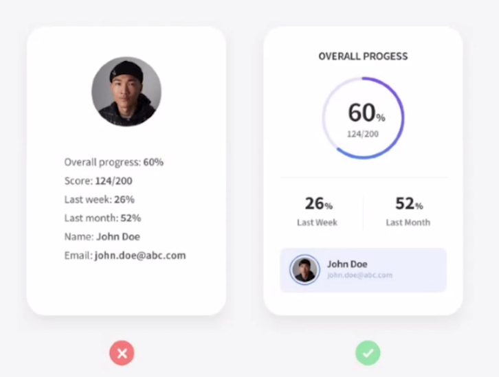
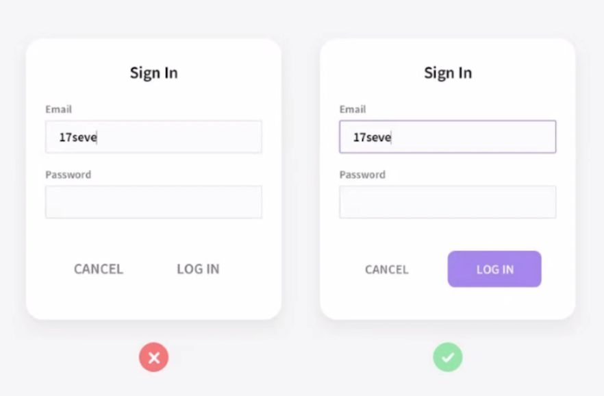
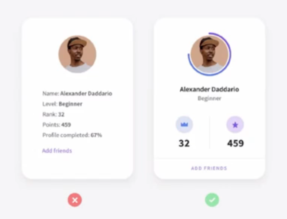
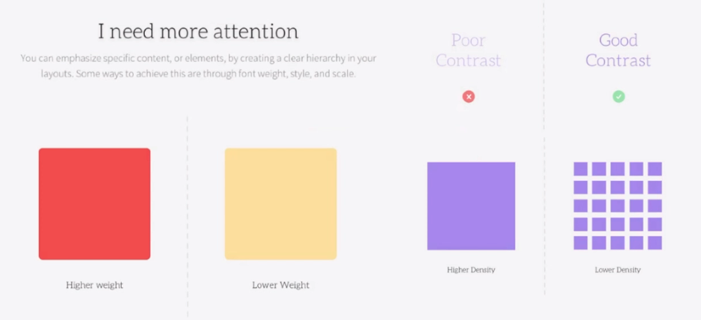
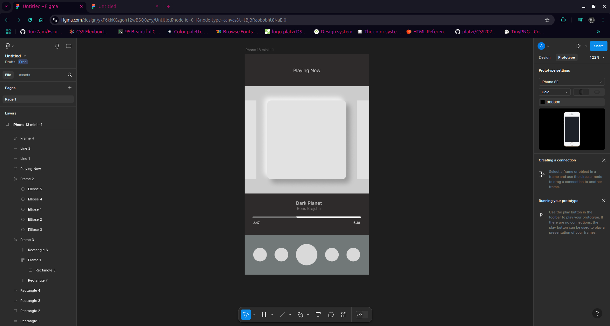
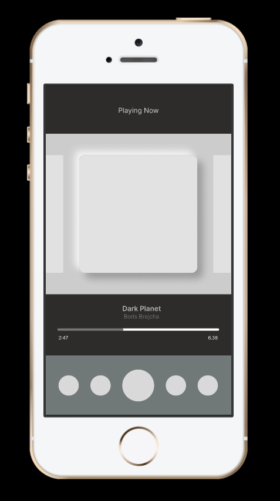

# Diseño Web para Desarrolladores

## Design System
Es una colección de componentes re-utilizables guiados por estándares claros.

Empresas como Airbnb, Uber e IBM han cambiado la forma en que diseñan productos digitales al incorporar sus propios sistemas de diseño únicos.

Cada una de estas empresas ha podido **cambiar el ritmo de creación e innovación dentro de sus equipos**, utilizando una colección de componentes repetibles y un conjunto de estándares que guían el uso de esos componentes.

Todo un equipo de producto, como pueden ser: programadores, ingenieros, diseñadores, gerentes de producto, equipo C-suite, etcétera, crean un Design System.

En el proceso, normalmente se hace un inventario de :

- Colores
- Logotipos
- Encabezados
- Pies de página
- Formularios
- Código

Y se llega a un consenso sobre cómo se deben diseñar, codificar, presentar y hablar de las cosas.

En resumen, un Design System, es un plan maestro, la fuente de toda la verdad, una referencia para asegurarse de que todos los que trabajan en el producto estén siempre en la misma página y tener ***Consistencia***

Para comenzar con un sistema de diseño podemos utilizar la guía de [Shopify Polaris](https://polaris.shopify.com/) o la documentación del [framework tailwindCSS](https://tailwindcss.com/docs/installation).

 

## Tendencias de diseño UI/UX: Fase de Inspiración y Creatividad

**Principios de diseño rápidos y útiles**

#### Jerarquía.
Es tener elementos mucho mas grandes que otros dependiendo de la relevancia que queremos darles.

 

 

#### Contraste
Utilizar color contrastantes para resaltar elementos importantes o que queremos destacar.

 

 

#### Proximidad
Tiene que ver con el tema de consistencia, es utilizar semejanza en items, colores, espacios, etc. para generar un diseño consistente que haga mas fácil la ubicación de los elementos.

 

 

#### Balance
Es parecido al tema de jerarquía, debemos utilizar los colores, tamaños, contrastes para darle un equilibrio visual al diseño.

 

 
 

## Wireframes y comunicación visual simple, intuitiva y atractiva.

Antes de comenzar cualquier diseño Teffcode recomienda saber que es lo que queremos hacer y lograr:

1. Saber que es lo que quiero: Para este curso haremos un reproductor de musica Mobile First.
2. Hacer un boceto (Wireframe) con lapiz y papel o con herramientas online
3. Pensar en la guía de estilos

Trabajaremos también con el tema de **Neumorphism**  
Tener en cuenta para el boceto que: ***Menos es más***  
Pensemos siempre en una comunicación visual simple, intuitiva y atractiva.  
Juega el papel de **usuario** siempre para todo lo que hagas.  
Se tu propio **tester**.

 
 

## Figma para devs: Auto Layout y Neumorphism

### Pequeña introducción a figma

Recomendaciones:  
[Figma Community](https://www.figma.com/community): el *"Github"* para los diseñadores.  
[Pinterest](https://mx.pinterest.com/): bueno para el moodboard  
Leer del tema antes de que lo vayamos a desarrollar.  

#### Instalacion de Figma
Vamos a la [pagina oficial de Figma](https://www.figma.com), hacemos login o signup y empezamos a diseñar, asi de facil. 

 

 

