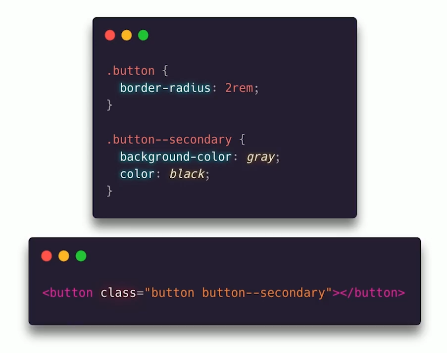
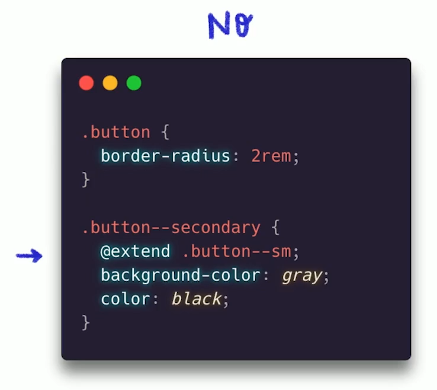
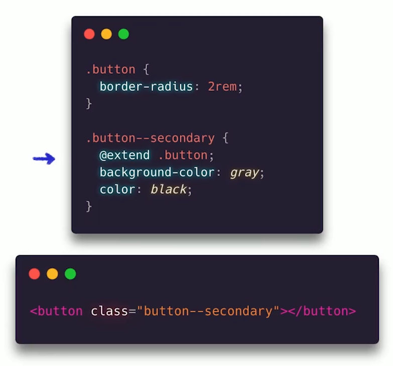
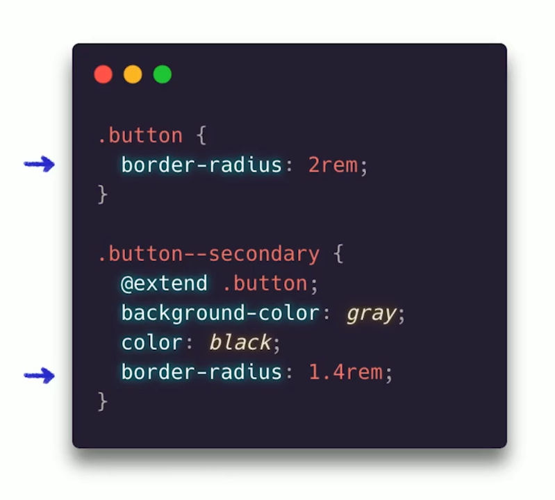
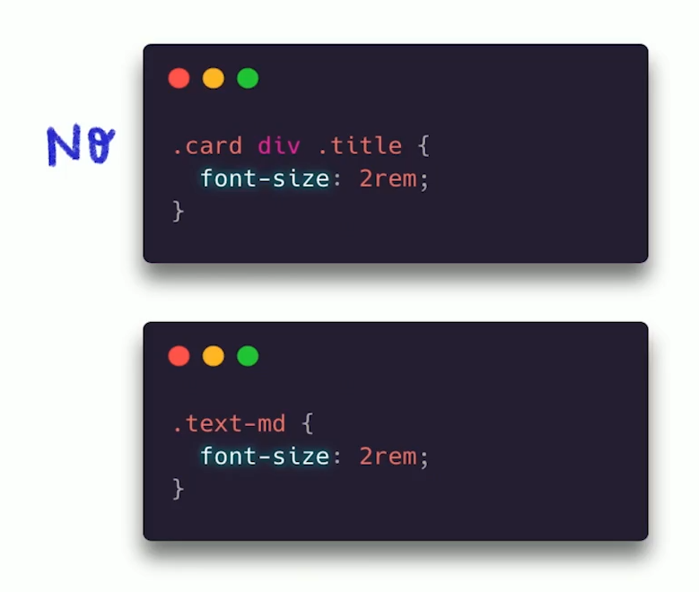
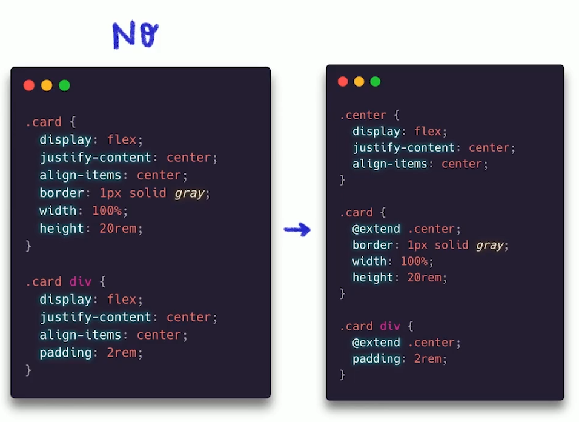
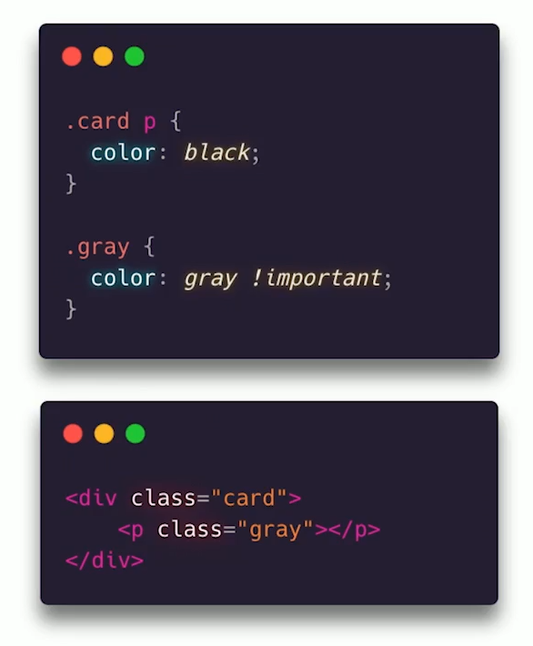

# Arquitecturas CSS

## Introducción
CSS es un lenguaje de estilos muy sencillo, pero aún así, se no puede complicar si no tenemos buenos hábitos o implementamos una buena práctica al escribirlo, por lo tanto debemos tener presente tres aspectos principales, necesitamos que el código sea:

- Limpio
- Escalable
- Mantenible

Para lograr esto, podemos tomar en cuenta los principios de la programación orientada a objetos:

- SOLID
- DRY
- IMMUTABILITY

### Arquitectura
La arquitectura en este contexto de CSS hace referencia a cómo se divide el código en archivos y carpetas.  
Y cómo trabajamos con nuestros selectores (Nombramiento de clases)

### Lo que veremos en este curso

Proyectos reales de estudiantes realizados con HTML, CSS, JavaScript, React, Vue y Angular.

Veremos metodologías, arquitecturas, cómo organizar nuestro código basado en éstos y nuestros principios.

Revisaremos cada proyecto y le haremos un **refactor** (re-estructuración del código implementando las metodologías y arquitecturas estudiadas)

## Principios de la OOP

### SOLID
Este principio es un acrónimo de los principios:
- **S - Single responsability principle**: una sola clase debe tener solamente una sola razón para cambiar.

 

 

- **O - Open-Close principle**: Las entidades de software deben estar abiertas para extensión, pero cerradas para modificación.

 

 

- **L - Liskov substitution**: "Un objeto puede ser reemplazado por un subobjeto sin romper el programa". - Barbara Liskov 

 

 

- **I - Interface Segregation**: No se debe obligar a ningún código a depender de métodos que no utiliza.

 

 

- **D - Dependency inversion**: Módulos de alto nivel no deben depender de módulos de bajo nivel. Ambos deberían depender de abstracciones.

 

 

### DRY

Por sus siglas en inglés: **Don't Repeat Yourself**, no te repitas a ti mismo. 
Esto basicamente quiere decir que no hay que repetir código, siempre buscar la manera de automatizar esas tareas que se repiten.

 

 

### Immutability

Hablamos de un objeto cuyo estado no puede ser modificado una vez creado.

 

