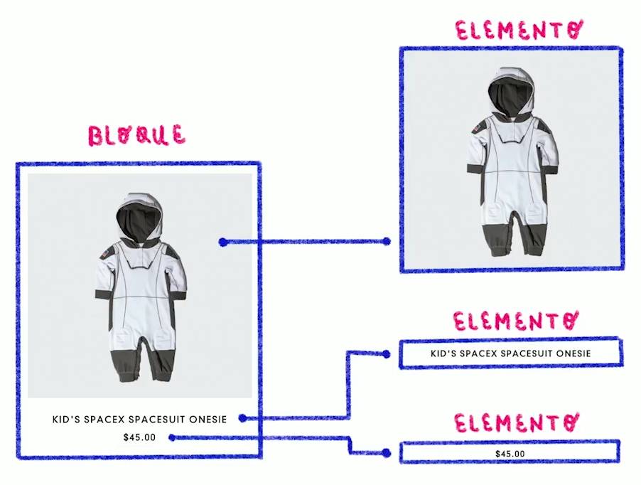
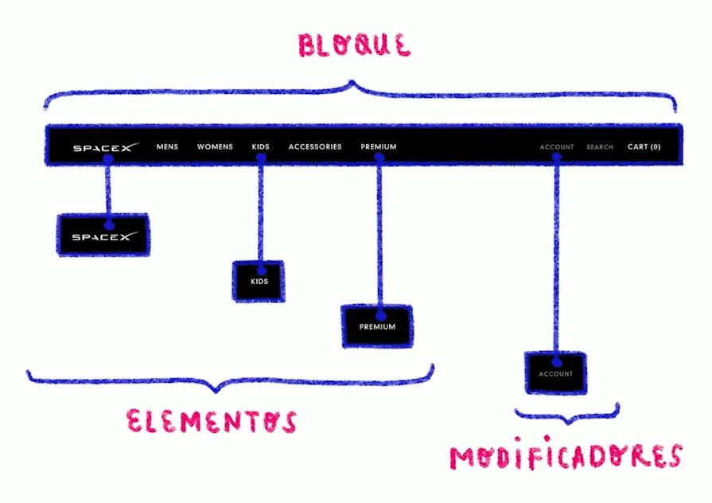
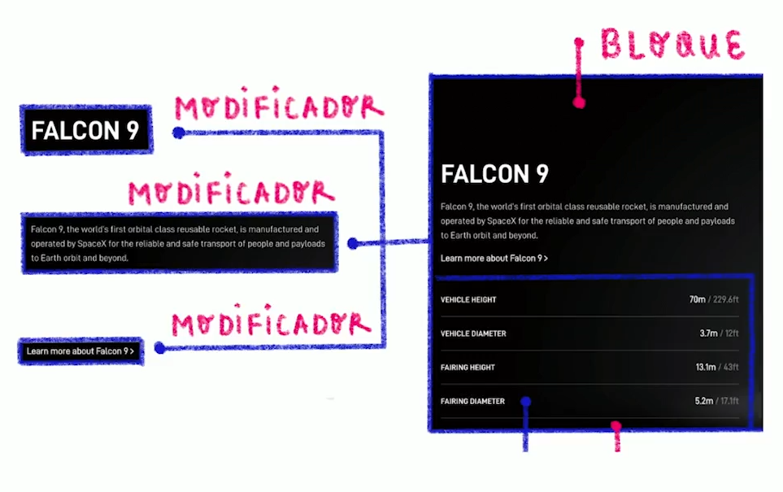

# Metodología BEM

Es una de las metodologías mas usadas actualmente, BEM significa:

- Block
- Element
- Modifier

Lo que aprenderemos de BEM:

- Cómo funciona
- Cómo usarlo
- Por qué y para qué
- Ejemplos prácticos
- Qué hacer en ciertos casos
- Problemas comunes
- BEM + Sass
- Recomendaciones

## Cómo funciona BEM

Como vimos al principio, BEM consta de tres partes, por sus siglas en inglés:

- **Block**: El bloque es el elemento principal, que contiene más elementos, tales como un header, un article, un aside, un button, una card, un form, etc.
- **Element**: Es el elemento que esta contenido por el bloque principal. Estos pueden ser, icon, text, item, image, input, button, etc.
- **Modifier**: Son los elementos conteidos que tienen alguna variación en su estilo. Son elementos tales como active, big, right, secondary, red, etc.

## Cómo usar BEM

La forma de utilizarlo es nombrando los tags de HTML de la siguiente manera para crear clases:

- [bloque]
- [bloque]__[elemento]
- [bloque]--[modificador]
- [elemento]--[modificador]
- [bloque]__[elemento]--[modificador]

Un ejemplo real podría ser este:

```css
.button {}
.button--active {}
.button__icon {}
.button__text {}
```
```html
<button class="button button--active">
    <i class="butto__icon"></i>
    <span class="button__text"></span>
</button>
```

Los guiones bajos (__) separan el bloque del elemento.  
Los guiones (--) separan el bloque o el elemento del modificador.

>Nota: BEM nos permite cambiar esa nomenclatura, lo más importante es ser consistente en todo el proyecto, y seguir la estrucura bloque | elemento | modificador:

[bloque]__[elemento]-[modificador]
[bloque]_[elemento]-[modificado]
[bloque]_[elemento]--[modificador]

### Por qué y para qué usar BEM

1. Tener un CSS más fácil de leer, entender, mantener y escalar.
2. Organizar las clases de CSS en módulos independientes.
3. Evitar selectores anidados.

### Práctica:

<br>


```html
<body>
    <header class="index-header">
        <div class="index-header__title-container">
            <h1 class="index-header__title"></h1>
            <h2 class="index-header__subtitle"></h2>
        </div>
        <div class="index-header__profile-image-container">
            
        </div>
    </header>
    <main>
        <section class="">
            <p class=""></p>
            <p></p>
            <p></p>
    </main>
```

## Ejemplos Practicos

<br>

Ejempolo 1:



<br>

- Bloque: Card
- Elementos: Image, Text
- Modificadores: no tiene.

```html
<div class="card">
    
    <p class="card__text"></p>
    <p class="card__text"></p>
</div>
```

<br>

Ejemplo 2:



<br>

- Bloque: navbar  
- Elementos: logo, elementos de lista(texto)  
- Modificadores: elementos de color gris

```html
<nav class="navbar">
    <ul class="navbar">
        <li class="navbar__item"><i class="navbar__icon"></i></li>
        <li class="navbar__item">MENS</li>
        <li class="navbar__item">WOMENS</li>
        <li class="navbar__item">KIDS</li>
        <li class="navbar__item">ACCESORIES</li>
        <li class="navbar__item">PREMIUM</li>
        <li class="navbar__item navbar__item--grey">ACCOUNT</li>
        <li class="navbar__item navbar__item--grey">SEARCH</li>
        <li class="navbar__item">CART (0)</li>
    </ul>
```

<br>

Ejemplo 3:



<br>

- Bloque: Section
- Elementos: Text, image
- Modificadores: Primary, secondary-semibold, secondary-bold

<br>

## Casos con lo que debes y no debes hacer con BEM


### Caso #1:
Lo que podemos hacer: Dejar clases principales con bloques y si es necesario despues una clase con modificador:

```html
<div class="card card--flat"></div>
```

Lo que no deberiamos hacer: Nombrar una clase solo con modificador

```html
<div class="card--flat"></div>
```

<br>

### Caso #2:
Lo que podemos hacer: Representar los elementos solo con el bloque aunque estos esten más profundo dentro de la jerarquía de etiquetas:

```html
<div class="card">
    
    <p class="card__text">
        <i class="card__icon">
    </p>
</div>
```

Lo que no debemos hacer: Representar los niveles de profundidad de HTML con BEM

```html
<div class="card">
    
    <p class="card__text">
        <i class="card__text__icon">
    </p>
</div>
```

<br>

### Caso #3
Lo que podemos hacer: Incluir la clase en un hijo que necesite estilos

```html
<div class="card">
    
</div>
```
```css
.card {}
.card__image {}
```

Lo que no debemos hacer: Omitir la clase en un hijo que necesita estilos.

```html
<div class="card">
    
</div>
```
```css
.card {}
.card img {}
```

<br>

## Problemas Comúnes

### Caso #1:

**Problema**: Tengo un componente ***"A"*** que ya tiene sus propias clases y deseo añadirlo a un nuevo componente ***"B"***,
¿Debo agregar una nueva convención para el componente ***"A"*** que está dentro de ***"B"***?

```html
<!--- Componente A --->
<button class="button button--active">Botón</button>

<!-- Componente B -->
<div class="card">
    
</div>
```

**Mi respuesta**:
```html
<div class="card">
    
    <button class="card__button card__button--active">Botón</button>
</div>
```

**Respuesta Instructora**:
```html
<div class="card">
    
    <button class="button button--active">Botón</button>
</div>
```

<br>

### Caso #2:

**Problema:** En mi estrutura de HTML tengo padres, hijos, nietos, tataranietos, etc; pero BEM sólo deja usar 3 niveles. ¿Qué hago con sus elementos nietos y sus descendientes?

```html
<div class="card">
    
    <div class="card__footer">
        <p class="card__footer__text">
            <i class="card__footer__text__icon">
        </p>
    </div>
</div>
```

**Mi respuesta:**

```html
<div class="card">
    
    <div class="card__footer">
        <p class="card__text">
            <i class="card__icon">
        </p>
    </div>
</div>
```

**Respuesta Instructora:**

```html
<div class="card">
    
    <div class="card__footer">
        <p class="card__text">
            <i class="card__icon">
        </p>
    </div>
</div>
```

<br>

### Caso #3:

**Problema:** Quiero utilizar la propiedad display:none para ocultar desde JS un componente de card y un componente de botón. ¿Debo crear una clase para cada componente siguiendo su propia estructura de BEM (card--hidden y button--hidden)?

```html
<div class="card card--hidden">
    
</div>
<button class="button button--hidden"></button>
```
```css
.card--hidden {
    display: none;
}
.button--hidden {
    display: none;
}
```

**Mi respuesta:** Yo creo que esta bien así.

**Respuesta instructora:**

```html
<div class="card hidden">
    
</div>
<button class="button hidden"></button>
```
```css
.hidden {
    display: none;
}
```

<br>

## BEM + Sass

Ejemplo:

```html
<div class="card">
    
    <button class="button button--active"></button>
</div>
```

Estilos sin Sass:
```css
.card {
    ...
}
.button {
    ...
}
.button--active {
    ...
}
```

Estilos con Sass:
```css
.card {
    ...
    &__image {
        ...
    }
}
.button {
    ...
    $--active {
        ...
    }
}
```

<br>

## Recomendaciones

- Los proyectos que usan BEM son:
  - Fáciles de leer
  - Muy intuitivos
  - Permiten evitar selectores anidados
- BEM permite personalizar sus reglas y nomenclaturas.