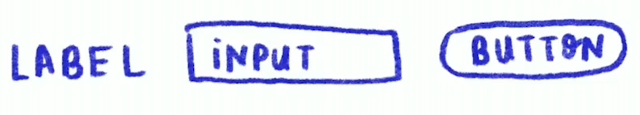
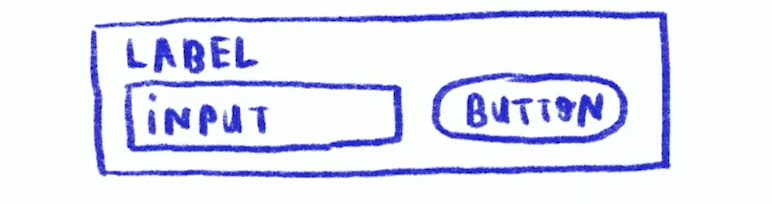
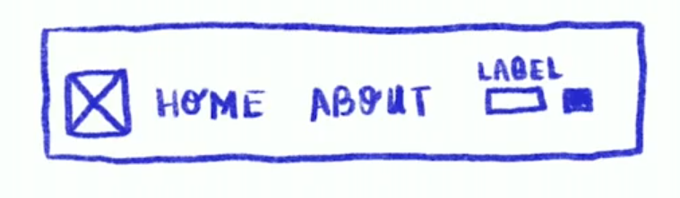
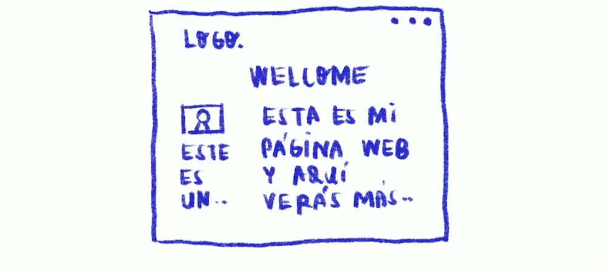

# Atomic Design

Brad Frost, el creador de la metodología atomic design, se inspiró en recordando las clases de química de la secundaria.

La analogía con los elementos de una web seria de la siguiente manera:

```
Átomos > Moléculas > Organismos > Plantillas > Páginas
```

## Átomos
Elementos de interfaz que no se puedan dividir más y sirven como bloques de construcción.  
Ejemplo: **Label, input, button**.

<br>



<br>

## Moléculas
Componentes un poco mas robustos, son colecciones de átomos que forman componentes de interfaz de usuario relativamente simples.  
Ejemplo: **Div padre conteniendo Label, input, button**.

<br>



<br>

## Organismos
Estructuras más complejas. Son componentes relativamente complejos que forman secciones discretas de interfaz.  
Ejemplo: **Un header con logo, barra de navegación, la molécula anterior**.

<br>



<br>

## Plantillas o templates
Colocan componentes dentro de un diseño y demuestran la estructura de contenido subyacente al diseño.  
Ejemplo: Como se vería la pagina a nivel global, **Header, footer, section etc.**
<br>


<br>

## Páginas
Aquí ya se aplica contenido real a las plantillas.

<br>

