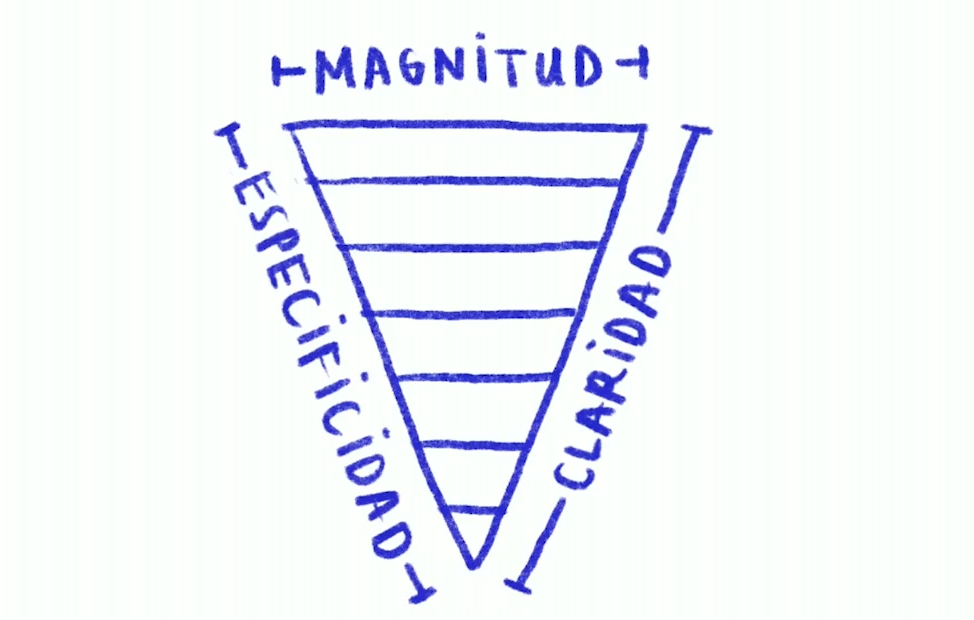
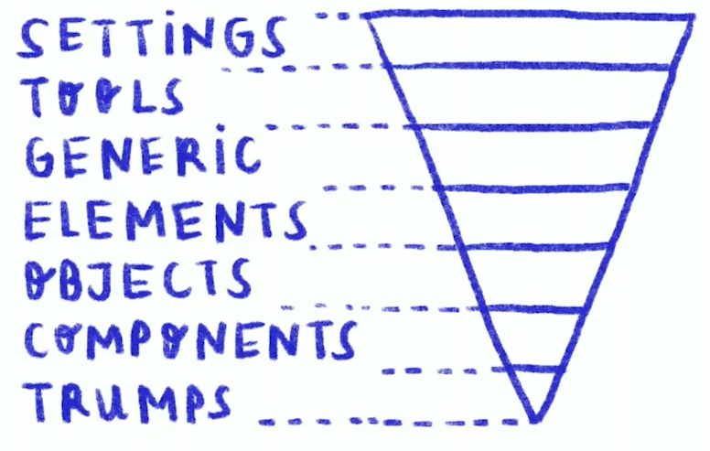

# Arquitectura ITCSS
Inverted Triangle CSS es una colección de principios y métricas.  
La idea es visualizar el CSS como un triángulo invertido en capas.  
Debemos entender:
- Principios Básicos
- Métricas clave
- Beneficios
- Capas
- Resultado

## Principios básicos
1. Sin ID en CSS.
2. Patrón Component UI.
3. Arquitectura Basada en clases.

## Métricas Clave
1. De estilos genéricos a estilos específicos.
2. De baja especificidad a alta especificidad.
3. De largo alcance a un alcance espefífico.

### Trinagulo Invertido




#### Magnitud
Alcance e impacto en cantidad de elementos.

#### Especificidad
Fuerza del selector y sus propiedades.

#### Claridad
Menor abstracción en la semántica e impacto del selector.

## Beneficios
- Estilos globales se comparten de manera más eficaz y eficiente.
- Disminución de batallas por especificidad.
- Menos redundancia.

## Capas
- Settings
- Tools
- Generic
- Elements
- Objects
- Components
- Trumps



### Settings
Ajustes: Variables globales
- Colores
- Tamaños
- Fuentes
- etc.

Ejemplo:
```css
/* main.scss file */
@import "settings.fontsize";
@import "settings.colors";
```

### Tools
Herramientas: funciones globales y mixins
- Solo si se husan pre-procesadores.

```css
/* main.scss file */
@import "tools.functions";
@import "tools.mixins";
```

### Generic
Genérico: CSS común

```css
/* main.scss file */
@import "generic.reset";
@import "generic.normalize";
```

### Elements
Elementos: estilos de selector de elementos.
- Nav
- Form

```css
/* main.scss file */
@import "elements.forms";
@import "elements.table";
```

### Objects
Objetos: selectores basados en clases para objetos.
- Contenedor

```css
/* main.scss file */
@import "objects.container";
@import "objects.grid";
```

### Components
Componentes: estilos para cada componente

```css
/* main.scss file */
@import "components.site-nav";
@import "components.buttons";
@import "components.carrousel";
```

### Trumps
Triunfos: estilos de utilidad y ayuda, puede anular estilos.
- !IMPORTANT

```css
@import "trumps.clearfix";
@import "trumps.utilities";
```