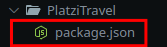
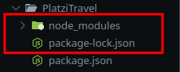
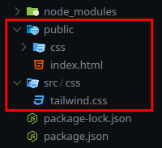
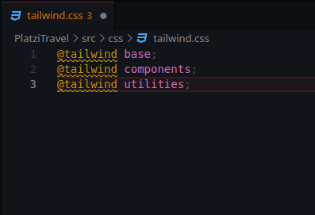
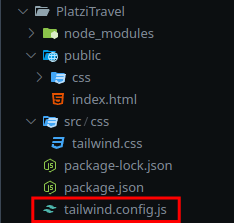
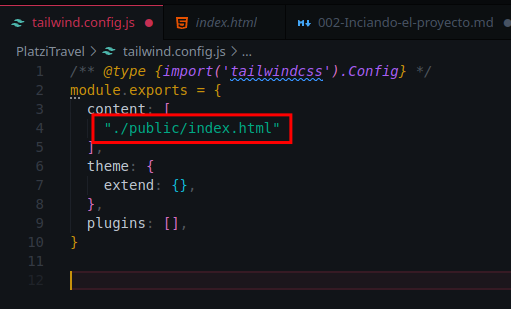

# Iniciando el proyecto: Instalación y directivas

## Instalación de TailwindCSS

### Instalación de Node.js
Debemos tener previamente instalado Node.js, yo lo instalé con el Package Manager [NVM](https://nodejs.org/en/download/package-manager)

<br>

### Instalación de TailwindCSS
Inicializamos un proyecto con npm:
```console
user~/folderProyecto/$ npm init
```
Tendremos un fichero json con información de nuestro proyecto



<br>

Instalaremos TailwindCSS como un plugin directamente sobre el proyecto:
```console
user~/folderProyecto/$ npm install -D tailwindcss postcss autoprefixer
```
Esto nos creará otro fichero json, y una carpeta con los módulos necesarios:



<br>

### Creación de directorios y ficheros iniciales del proyecto
Creamos dos carpetas, public y source:
```console
user~/folderProyecto/$ mkdir src public
```

Dentro de ellas crearemos dos carpeta css, una en cada una:
```console
user~/folderProyecto/$ mkdir src/css public/css
```

A su vez, dentro de estas crearemos dos archivos css, una en cada una:
```console
user~/folderProyecto/$ touch src/css/tailwind.css public/css/tailwind.css
```

Alternativamente podemos crear todos los directorios necesarios en un a sola lina con el mismo comando mkdir implementeando la flag -p y  con el operador logico && de esta manera:
```console
user~/folderProyecto/$ mkdir -p src/css public/css && touch src/css/tailwind.css public/css/tailwind.css
```

Creamos nuestro index.html en la carpeta public:
```console
user~/folderProyecto/$ touch public/index.html
```

Nos quedara de la siguiente manera:



<br>

### Configuración de TailwindCSS

Agregamos unas directivas al fichero css de source:
```
@tailwind base;
@tailwind components;
@tailwind utilities;
```
    


Agregamos el archivo de configuracion de tailwind:
```console
user~/folderProyecto/$ npx tailwindcss init
```



Agregamos la ruta de las plantillas al fichero que se acaba de crear:
```
 "./public/**/*.{html,js}"
```



<br>

### Creamos nuestra página
Agregamos las clases a los elementos html para darle estilos

```html
<p>Hello World</p>
<div class="w-64 h-64 bg-red-500></div>
```
Hacemos un rebuild de las rutas para agregar el código css a los templates.

```console
npx tailwindcss -i ./src/css/tailwind.css -o ./public/css/tailwind.css
```
y ya tendremos nuestros estilos:


<br>

## Directivas
Las directivas son instrucciones que nos permiten insertar código a nuestro fichero final de css. Nosotros estaremos utilizando tres directivas principales de tailwind:

- **@tailwind base**: Inicializa todos los elementos de nuestro HTML sin estilo.
- **@tailwind component**: Nos permite acceder a todas las clases de tailwind.
- **@tailwind utlility**: Agrega todas las utilidades al proyecto y nos permite acceder a ellas.

Existen algunas otras que podemos agregar también como: 

- **@layer**
- **@apply**
- **@config**