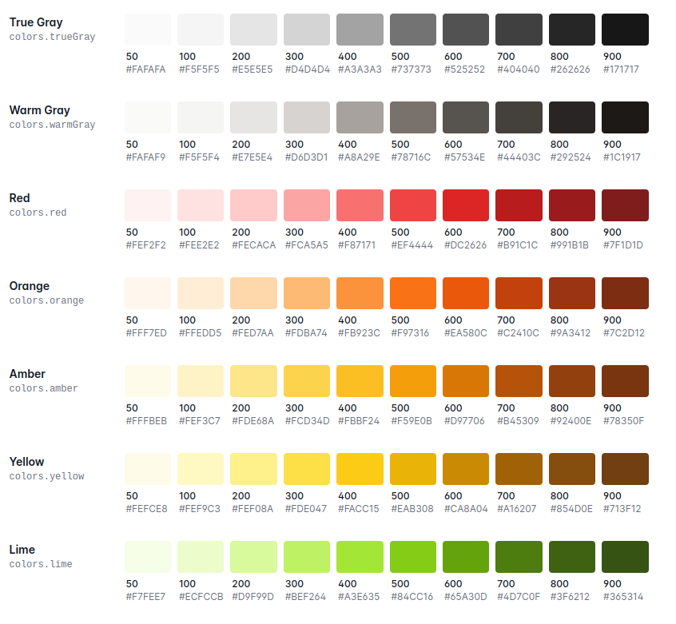
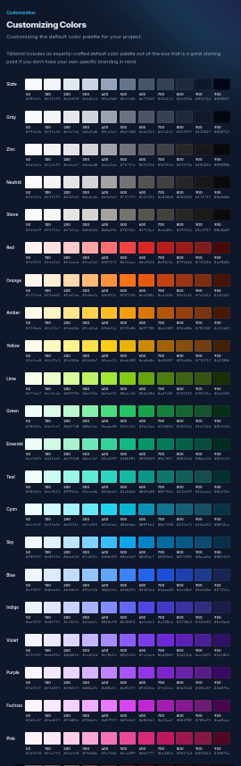
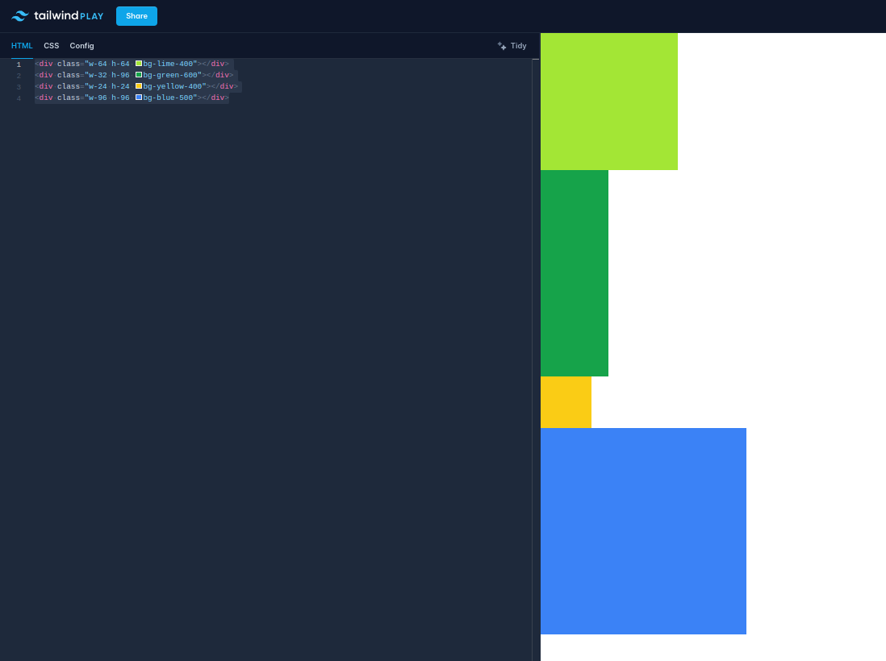
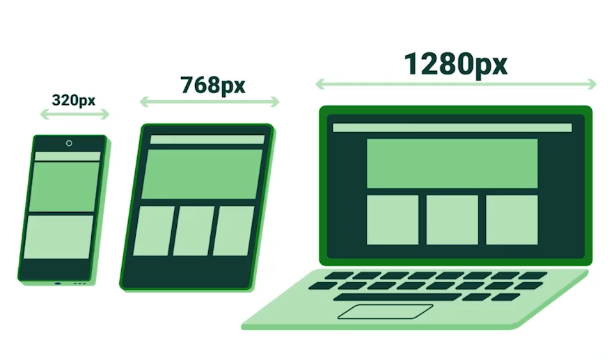

# Utilidades

## Nueva paleta de colores extendida
Los colores disponiles en tailwind 2 los encontramos en [este enlace](https://v2.tailwindcss.com/docs/customizing-colors)



Y los colores de la última versión, que es la 3, [aquí](https://tailwindcss.com/docs/customizing-colors)



Aquí tenemos un ejemplo en el [Playground](https://play.tailwindcss.com/) de Tailwind:
```html
<div class="w-64 h-64 bg-lime-400"></div>
<div class="w-32 h-96 bg-green-600"></div>
<div class="w-24 h-24 bg-yellow-400"></div>
<div class="w-96 h-96 bg-blue-500"></div>
```



<br>

## Medidas y Breakpoints

### Breakpoints
Un breakpoint es el tamaño de la pantalla en la que nuestro sitio hará un "salto" a un layout que se ajuste a ese tamaño.  
Podemos manipular los estilos de nuestro archivo en función al tipo de dispositivo. Tailwind es mobile first por lo que nosotros en todo momento vamos a estar trabajando con el breakpoint small(sm) correspondiete a los smartphones, que es aproximadamente entre 320-415px; el tamaño medium(md) es de entre 768-1024px que corresponde a dispositivos tipo tablet; y el tamaño large(lg) correspondiente a los equipos pc desktop-laptop que van de 1280 a 1440px.



<br>

### Medidas

