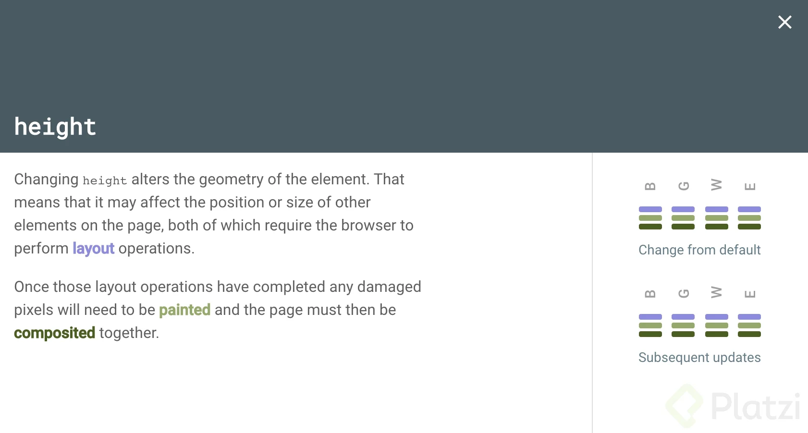
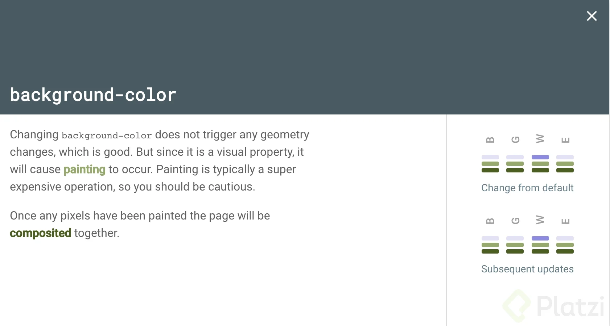
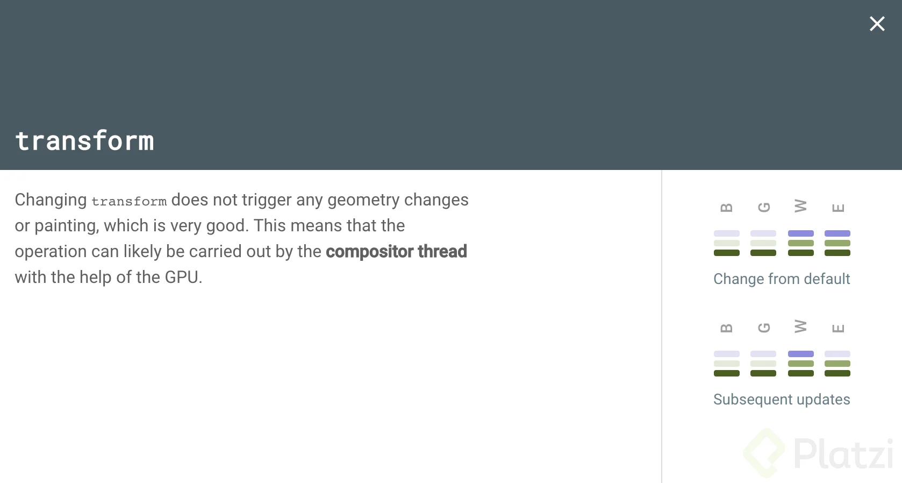
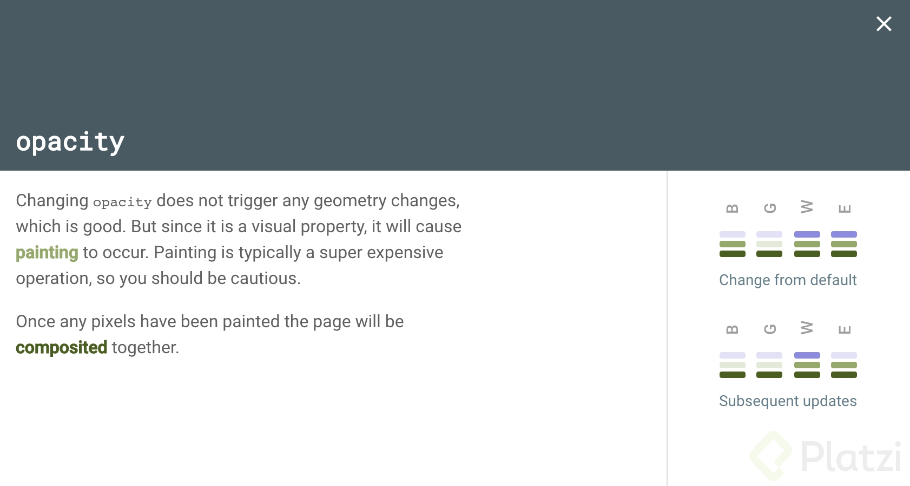

# Rendimiento y accesibilidad

## Propiedades recomendadas y no recomendadas para animar

Al hacer animaciones debemos fijarnos que no sean demasiado costosas computacionalmente para que parezcan inestables y poco fluidas.

Para ello, debemos comprender un concepto clave llamado: el proceso de renderizado.

Resulta que, como el navegador no entiende el código que hacemos, debe hacer una trasformación de ese código para que finalmente pueda ser entendido y visualizado en la pantalla.

Esa transformación se hace en una serie de pasos como los que puedes ver a continuación:

-3bf8f82c-dcca-4cd0-b1fd-2f6f1bededea.webp>)

Sin embargo, los pasos que nos interesan en este momento son los últimos 3: _Layout_, _Paint_ y _Composite_. Cada uno cumple un papel muy importante, pero no todas las propiedades pasan por estos 3 procesos.

Si una propiedad debe pasar por el nivel de _Layout_, obligatoriamente debe pasar por _Paint_ y _composite_ también. Si una propiedad debe pasar por el nivel _Paint_, obligatoriamente debe pasar por _Composite_ también. Pero si una propiedad debe pasar por el nivel de _Composite_, no debe pasar por ningún otro nivel.

Con lo anterior, podemos darnos cuenta de que hay propiedades que requieren un costo mayor que otras al tener que pasar por más pasos. Puedes revisar el proceso de renderizado que realiza cada propiedad en esta página: [css triggers](https://csstriggers.com/). Revisemos algunas de ellas:

- Propiedad _height_: En cada uno de los motores de renderizado, podemos darnos cuenta por la imagen de abajo que requiere de los pasos de _Layout_, _Paint_ y _Composite_, lo cual es bastante costoso.



- Propiedad _background-color_: Es una propiedad que no afecta el diseño (_layout_) pero requiere una nueva capa de pintura (_paint_), lo cual la hace una propiedad también costosa.



- Propiedad _transform_ y _opacity_: Estas dos propiedades sólo requieren del paso de Composite, lo cual las hace muy baratas de animar. Si necesitas modificar propiedades como _width_ y _left_ (propiedades costosas), puedes reemplazarlas usando la propiedad transform para tratar de lograr el mismo efecto.





Finalmente, si sabemos por cuáles pasos de renderizado pasa cada una de las propiedades, sabemos con exactitud cuáles propiedades son más costosas y menos recomendadas para animar (como _height_, _width_ y _background-color_), como también, cuáles propiedades son menos costosas y más recomendables para animar (como _transform_ y _opacity_).

_**Recursos**_:

- [Inside a super fast CSS engine: Quantum CSS (aka Stylo)](https://hacks.mozilla.org/2017/08/inside-a-super-fast-css-engine-quantum-css-aka-stylo/)

## Aceleración de hardware y la propiedad will-change

```html
<head>
  <meta charset="UTF-8">
  <meta name="viewport" content="width=device-width, initial-scale=1.0">
  <title>Rendimiento y accesibilidad</title>
  <style>
    button {
      background-color: palegoldenrod;
      width: 100px;
      height: 30px;
    }
    .better {
      will-change: transform;
      transition: transform 500ms;
    }
    .better:hover {
      transform: translateY(5px);
    }
    .worst {
      will-change: transform;
      transition: margin-top 500ms;
    }
    .worst:hover {
      margin-top: 5px;
    }
  </style>
</head>
<body>
  <div class="container">
    <button class="better"></button>
    <button class="worst"></button>
  </div>
</body>
```

## Preferencias de movimiento reducido

Hay personas que captan la realidad de distinta forma que nosotros, es así también en el mundo web, en donde nos podemos encontrar con personas que no gustan de ver mucho movimiento. Por tal motivo existen estas preferencias denominadas _**Reduced Movement Preferences**_, 

_**Recursos**_:

- [valhead.com](https://valhead.com/books/)