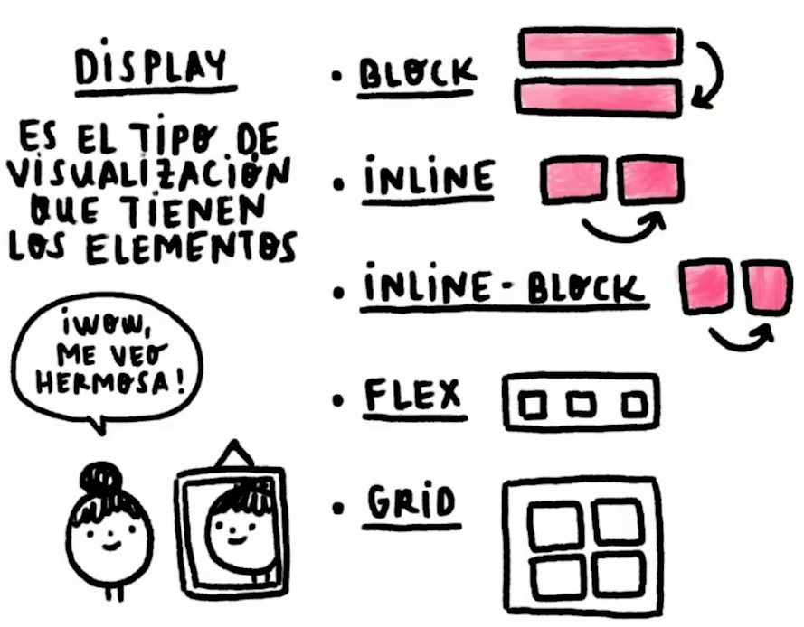
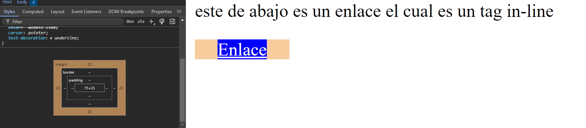

## 6. Tipos de Display

<br>

El tipo de display, es el tipo de visualización que van a tener nuestros elementos html. Cada etiqueta de html tiene una tipo de visualización (in-line, block).  
En CSS se ocupan bastante los siguientes tipos de display:

- Block
- In-Line
- Inline-Block
- FlexBox
- CSSGrid

<br>



<br>

En [HTML Reference](https://htmlreference.io) podemos verificar el tipo de display que tiene cada tag de HTML.

<br>


<br>

### Block (en bloque)

Los tags de tipo block, por default, ocupan todo el espacio en pantalla, sin propiedades, se van apilando uno por debajo del otro, según vayamos colocando en orden nuestras etiquetas, pueden ser modificados mediante width, height y margin los cuales son ancho, alto y margen, respectivamente.

```html
<!DOCTYPE html>
<head>
    <style>
        div {
            background: salmon;
            color: white;
        }
    </style>
</head>
<body>
    <div>Esto es un div el cual es un tag de tipo bloque</div>
</body>
```


Podemos darle un tamaño y margenes:

```html
 <head>
    <style>
            div {
                background: salmon;
                color: white; 
                width: 100px;
                height: 75px;
                margin: 25px;
            }
    </style>
</head>
<body>
    <div>Esto es un div, el cual es un tag de tipo bloque</div>    
</body>
```


<br>
<br>

### In-line (en línea)

Tenemos también los tags in-line, que solamente ocupan el espacio que tiene su contenido, estos se van acomodando de izquierda a derecha según vaya teniendo espacio la pantalla en el navegador y estos no es posible modificar width ni height, y el margen solo se aplica en ambos lados, pero no en la parte superior ni inferior, por ejemplo el tag a:

```html
 <head>
    <style>
            div {
                background: salmon;
                color: white; 
                width: 100px;
                height: 75px;
                margin: 25px;
            }
            a {
                color: white;
                background: blue;
                width: 75px;
                height: 25px;
                margin: 20px;
            }
    </style>
</head>
<body>
    <div>Esto es un div, el cual es un tag de tipo bloque</div>
    <p>este de abajo es un enlace el cual es un tag in-line</p>    
    <a href="#">Enlace</a>
</body>
```
<br>
<br>


<br>
<br>

En el inspector del navegador nos podemos dar cuenta de las propiedades que hemos declarado y las que se han aplicado realmente.

<br>



<br>

El width y el height no se han aplicado en absoluto, mientras que el margen solo se ha aplicado en ambos lados del elemento.

<br>
<br>

### In-line-Block

Tienen la propiedad in-line, pero es posible modificar su ancho, alto y margen.

```html
 <head>
    <style>
            div {
                background: salmon;
                color: white; 
                width: 100px;
                height: 75px;
                margin: 25px;
            }
            p {
            color: red;
        }
            a {
                color: white;
                background: blue;
                width: 75px;
                height: 25px;
                margin: 20px;
            }
            button {
            color: white;
            background: purple;
        }
        .b1 {
            color: white;
            background: indigo;
            width: 75px;
            height: 30px;
            margin: 15px;
        }
            span {
                color: green;
        }
    </style>
</head>
<body>
    <div>Esto es un div, el cual es un tag de tipo bloque</div>
    <p>este de abajo es un enlace el cual es un tag in-line</p>    
    <a href="#">Enlace</a>
    <a href="#">otro enlace</a><span>tags in-line se acomodan en horizontal</span>
    <p>este de abajo es un boton el cual es un tag in-line-block</p>
    <button>Botón</button>
    <button class="b1">Botón 2</button>
</body>
```

<br>
<br>


<br>

podemos ver en el inspector las propiedades del boton 2:

<br>


