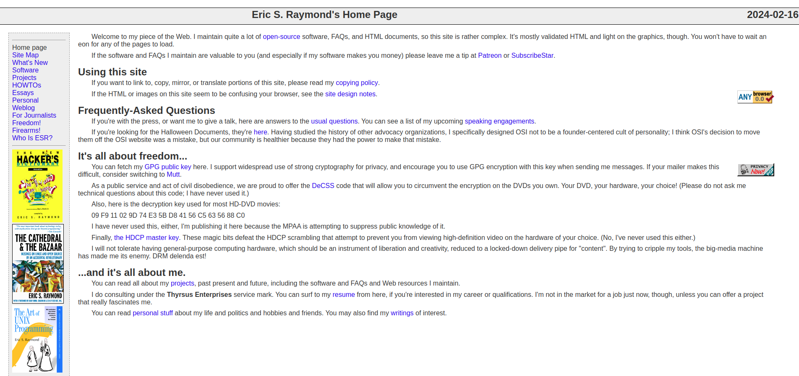
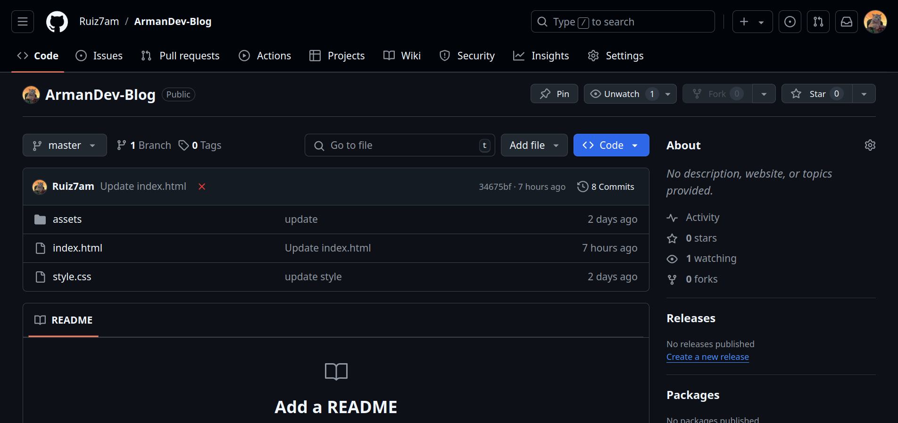

# Curso definitivo de HTML y CSS

En el desarrollo web nos tocará desarrollar tanto paginas estáticas como  dinámicas.

## Paginas Estáticas.
Productos y paginas web que van a tener una información para consumir, ya sea texto imágenes, y que esta información no va a cambiar.  
Por ejemplo un blog personal.  
A estas paginas se les denomina también paginas informativas o landing pages.

Aquí un ejemplo de pagina estática, la pagina personal de Eric Raymond

 

 

## Paginas Dinámicas.
También conocidas como webapps, dejan de ser solamente una pagina y se convierten en aplicaciones, en donde se interactúa con el sitio, existen bases de datos.

Un ejemplo de pagina dinámica, es github.com, de microsoft, en la cual están alojados estos apuntes:

 

