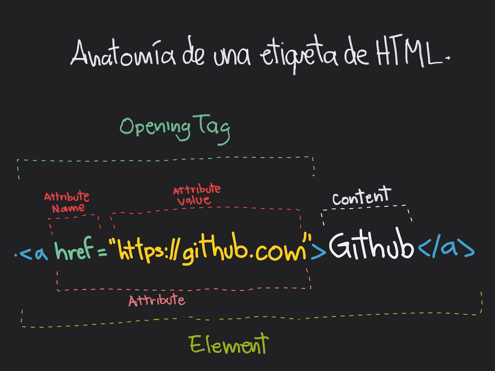

# Anatomía de una etiqueta HTML y estructura básica de un archivo index.html

<br>

## Anatomía de una etiqueta HTML



<br>

## Estructura básica de un fichero index.html

Cuando buscamos un sitio web en el navegador, éste lo primero que hace al encontrar la dirección de sitio es solicitar un fichero principal denominado index.html, el cual es la primera pagina, o pagina principal de todo sitio web, sin esta no sera posible ingresar al sitio a menos que le indiquemos al navegador que nuestra pagina principal es otra.  
De no encontrarla lo que puede suceder, si no esta bien configurado el servidor web, es que mostrará todo nuestro sistema de archivos al usuario, lo cual representa un fallo de seguridad.

La estructura en el gran orden del fichero html consta de dos partes, el head y el body, que, como sus nombres lo indican, son la cabeza y el cuerpo de la estructura de todo fichero html.

### Head

```html
<!DOCTYPE html> <!--- Le indica al navegador que se trata de un fichero html version 5 --->
<html lang="es"> <!--- Contenedor principal padre, lleva todas las etiquetas que usaremos en nuestro sitio,
     y este tiene un atributo especial el cual es lang, que le indica al navegador en que idioma esta 
     escrito el archivo --->

<!--- Es buena practica utilizar espacios y tabulaciones para mantener 
nuestro codigo bien estructurado y legible --->

<!-- Hay etiquetas que tiene etiquetas de apertura y cierre y hay otras que solo tienen una sola etiqueta. -->

<head> <!-- Aqui va todo llo que es importante para el navegador para poder cargar el 
    proyecto de la forma en la que nosotros lo construimos, pero no es visible para el usuario-->

    <meta /> <!-- le dan cierta información al navegador para que sepa como tratar nuestro proyecto, 
    meta es una de las etiquetas que se autocierra, es decir que no necesita una etiqueta de cierre, 
    puede o no llevar una diagonal al final y antes del pico parentesis -->

    <meta charset="UTF-8"> <!-- Esta etiqueta le indica al navegador que utilizara la tabla de conversión 
    de caracteres UTF-8, para que pueda reconocer todos los caracteres posibles -->

    <meta name="description" content="esta pagina te mostrará fotos de gatitos"> <!-- Agrega una descripción corta 
    debajo de nuestra url al momento de ser mostrada por un buscador -->

    <meta name="robots" content="index,follow"> <!-- Autoriza a los robots(web pages crawler) para que pueda 
    indexar nuestra pagina en los navegadores -->

    <meta name="viewport" content="width=device-width, initial-scale=1.0"> <!-- Permite
    escalar el el contenido al ancho de la pantalla dependiendo el dispositivo del usuario.-->

    <link rel="stylesheet" href="style.css"> <!-- Hace referencia al fichero de estilos de nuestro proyecto -->

    <title>Este es el nombre de mi archivo</title>
</head>
<body>

</body>
</html>
```

<br>

Sin tanto comentario la cabecera de nuestro archivo se vería así:

```html
<!DOCTYPE html>
<html lang="es">
<head>
    <meta charset="UTF-8">
    <meta name="description" content="Esta pagina te mostrará los apuntes del curso">
    <meta name="robots" content="index,follow">
    <meta name="viewport" content="width=initial-scale=1.0">
    <link rel="stylesheet" href="style.css">
    <title>Este es el titulo de la pagina actual, que se vera en la pestaña del navegador</title>
</head>
</html>
```

### Body

Existen etiquetas de contenido y etiquetas contenedoras

```html
<!DOCTYPE html>
<html lang="es">
<head>
    <meta charset="UTF-8">
    <meta name="description" content="Esta pagina te mostrará los apuntes del curso">
    <meta name="robots" content="index,follow">
    <meta name="viewport" content="width=initial-scale=1.0">
    <link rel="stylesheet" href="style.css">
    <title>Este es el titulo de la pagina actual, que se vera en la pestaña del navegador</title>
</head>
<body>
    <header><!-- es la cabecera del body, en donde va el titiulo y depende del diseño, 
            también la barra de navegacion -->
        <nav></nav>
    </header> 
    
    <main> <!-- Contiene la parte principal de nuestro sitio, el contenido con mayor peso visual. -->

        <section> <!-- Dentro de main podemos poner etiquetas section para separar las diferentes secciones
            que queramos crear -->
            <article> <!-- A su vez podemos crear, dentro de section, artículos referentes al mismo tema, 
                o simplemente para agregar mas orden y consistencia a nuestro sitio, con la etiqueta article -->

            </article>
        </section>
       
       <!-- para crear listas ocupamos las etiquetas ul y ol, las cuales son listas desordenadas y listas ordenadas,
        respectivamente, y dentro de ellas se utiliza la etqueta li de list item, que son los objetos que
        ingresaremos a la lista, la lista desordenada va a ordenar los items con un punto llamado bullet, y las
        ordenadas con números consecutivos. puede haber listas anidadas -->
        <ul>
            <li>Soy un Objeto de lista desordenada</li>
        </ul>

        <ol>
            <li>Soy un objeto de lista ordenada</li>
        </ol>

        <h1>Etiquetas de Titulo</h1> <!-- Los titulos pueden ser escritos con la etiqueta h1, van desde h1 hasta h6 
        cada uno de estos nos dará un tamaño de fuente diferente. -->

        <p>Etiqueta de parrafo, para escribir contenido</p> <!-- esta etiqueta nos permite ingresar parrafos -->

        <a href="#">Soy un link</a> <!-- la etiqueta anchor nos permite crear enlaces o hipervinculos (la base)
        de html) para poder navegar entre paginas. -->
    </main>
    <footer>
    </footer>
</body>
</html>

```
