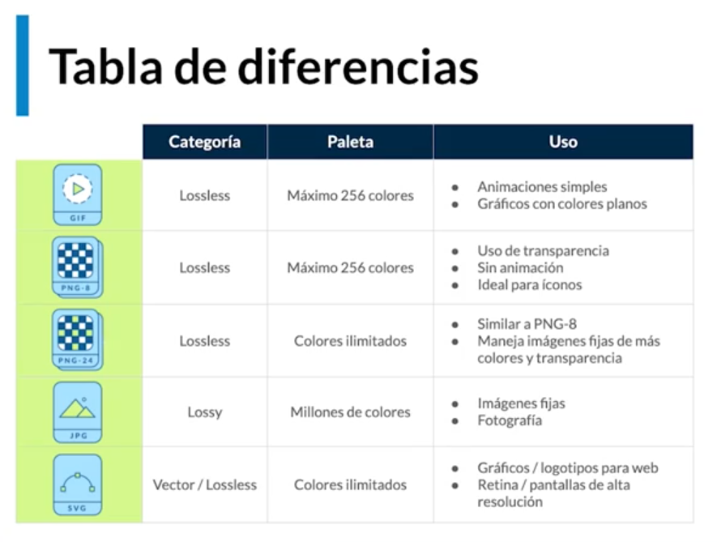

# Etiquetas multimedia

## Imágenes Lossy vs Lossless

Existen dos tipos de imágenes, sin pérdida o con pérdida, y esto depende de cómo el formato maneja las imágenes.

### Lossless

Los formatos de imagen sin pérdida capturan todos los datos de su archivo original. No se pierde nada del archivo original, foto u obra de arte, de ahí el término "sin pérdida". El archivo aún puede estar comprimido, pero todos los formatos sin pérdida podrán reconstruir su imagen a su estado original. Pero pueden ser muy pesadas.

- GIF - Graphic Interchange Format
- SVG - Scalable Vector Graphics (Vectores sin pérdidas, mejores para logotipos, utilizan un algoritmo matemático para reubicar pixeles, es bueno para cuando se hace zoom en la pantalla)

### Lossy

Los formatos de imagen con pérdida se aproximan a su imagen original. Por ejemplo, una imagen con pérdida podría reducir la cantidad de colores en su imagen o analizar la imagen en busca de datos innecesarios. Esto reducirá el tamaño del archivo, aunque pueda reducir la calidad de imagen. Son mejores para web por la rapidez con la que cargan.

- PNG 8 - Portable Network Graphics (Tiene gama de 256 colores, maneja transparencias).  
- PNG 24 - (Tiene una gama de 16.7 millones de colores pero es más pesado.)
- JPG/JPEG - Photographic Experts Group (Pierden mucha calidad, son mejores para manejar fotografía.) 

<br>



<br>

## Optimización de imágenes.

El tamaño óptimo para utilizar imágenes en web es de 70kb.  
Para poder optimizar una página podemos utilizar las siguientes herramientas online:

- Para mejorar el tamaño: Tiny PNG
- Para retirar metadatos: Verexif

> Aporte de compañero: 


### Etiqueta img y figure

```html
<figure> <!-- encapsula y agrega una descripción -->
    
    <figcaption>Descripción de la imagen</figcaption>
</figure>
```
<br>

## Etiqueta video