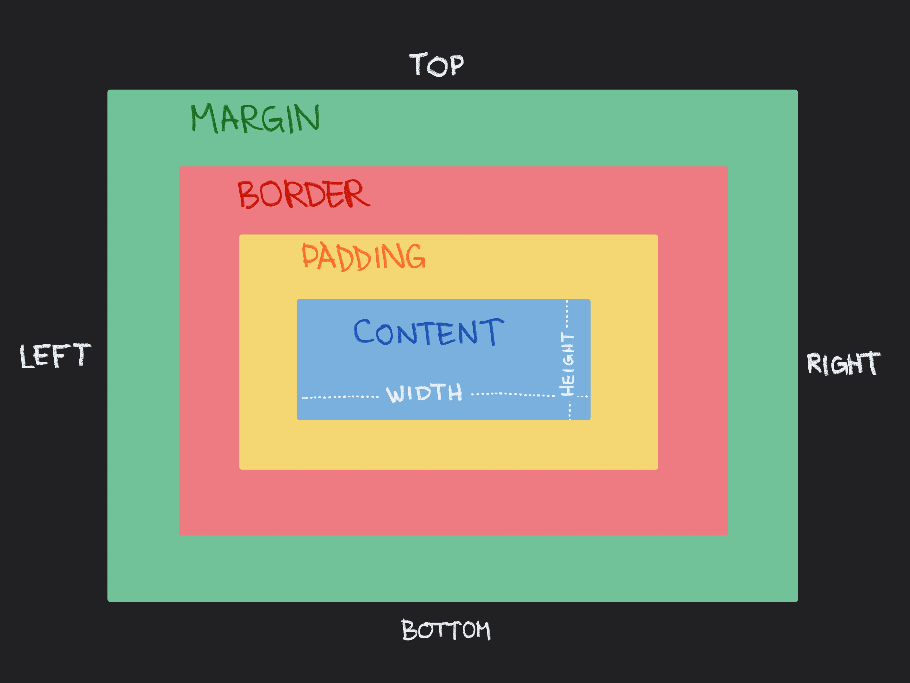
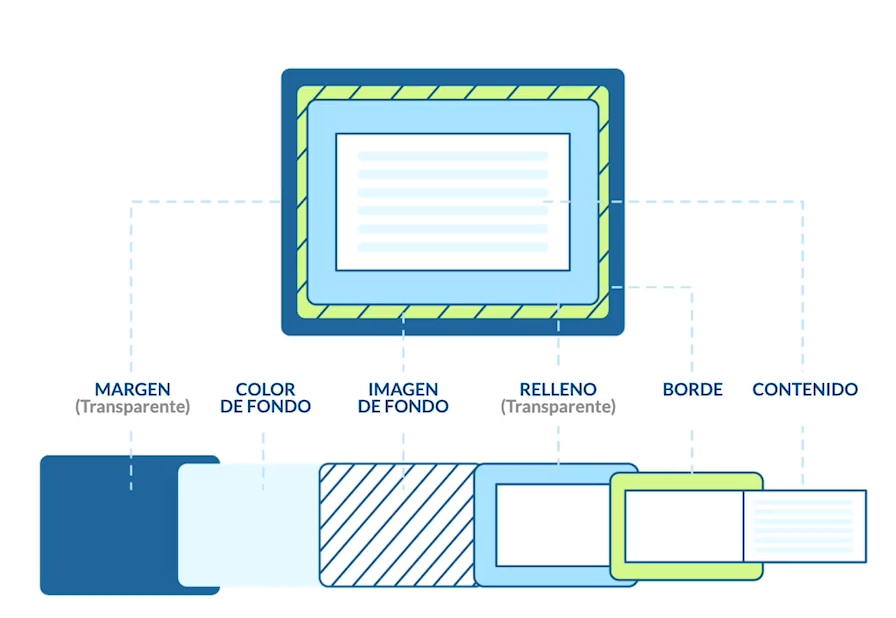
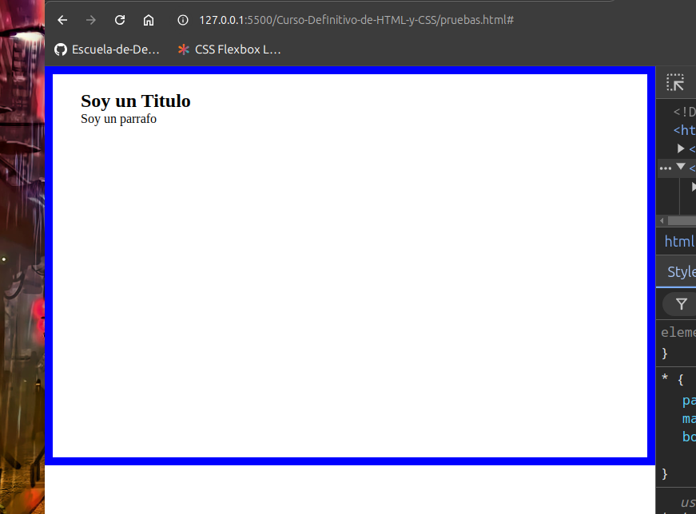
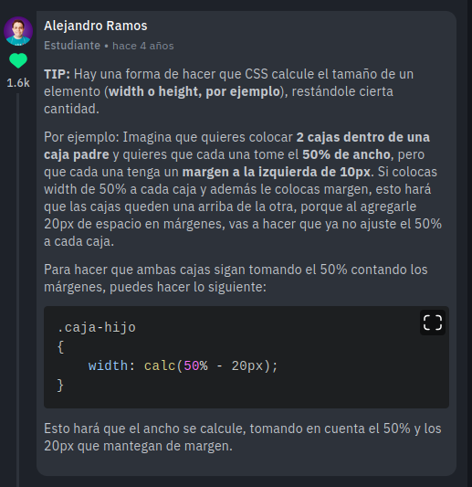
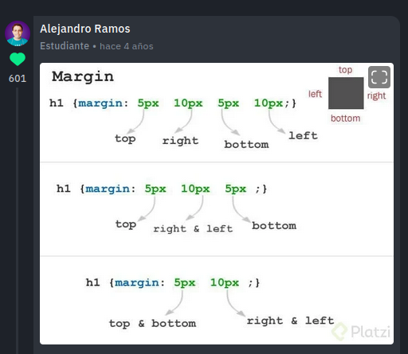

# Modelo de caja

En el modelo de caja, todos los elementos son tratados como una caja, es decir que tiene cuatro lados rectos y a ese modelo podemos aplicar ciertos estilos de acomodo y visualización.

<br>



En esta imagen podemos ver todas las caracteristicas que tiene el modelo de caja.

- **Content**: Es el contenido del elemento que tenemos en nuestro html, podemos darle un ancho y un alto (width and height).
- **Padding**: Traducido al español significa relleno, pero aqui en realidad es una especie de margen pero interno, agrega un espacio entre el contenido y el borde. Esta caracteristica es invisible y no podemos agregarle un color, se usa solamente para dar espacio.
- **Border**: Es un borde que rodea todo el contenido, puede ser invisible (lo es por defecto) o podemos agregar color y diseño.
- **Margin**: Es un margen externo, da espacio entre el borde y lo que se encuentra a su alrededor. Igual que el padding, es una caracteristica invisible.
- **Top, Right, Bottom y Left**: Denominación de cada lado de la caja respectivamente, se utilizan para especificar a que lados queremos aplicar estilos, y se pueden utilizar a todos las caracteristicas anteriores: , Padding, Border

<br>



En esta otra imagen podemos ver desglosados las caracterisiticas.

<br>
<br>

Aquí tenemos un ejemplo que facilita ver cada caracterisitica del modelo de caja
```css
/* css */
* { /* Este selector, denominado universal aplica estilos a todo el documento html, en este caso se esta
    utilizando para eliminar los margenes interno y externo que el navegador aplica por defecto. */
    padding: 0;
    margin: 0;
    box-sizing: border-box; /* calcula y ajusta los tamaños cuando hay un overflow, que nos provoca un scroll */
}
main { /* Hay que ser muy precisos con las medidas y tomar en cuenta los tamaños de margenes internos y externos
    y los bordes, porque todo se suma a la medida total */
    margin: 10px;
    width: 100%;
    height: 500px;
    border:10px solid blue;
    padding: 20px 35px;
}
```

<br>

```html
<!-- html -->
<main>
    <section>
        <h1>Soy un Titulo</h1>
        <div>
            <p>Soy un parrafo</p>
        </div>
    </section>
   </main>
```

<br>

El resultado es este:



<br>

#### Aportes de compañeros

 