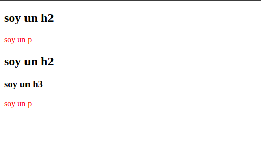

# Combinadores (Combinators)

Estos nos van a ayudar a tener una especificidad mucho mas certera, y nos ayudará e evitar tener muchos id o id con muchas etiquetas, tenemos cuatro opciones principales:

<br>

1. **Hermano adyacente** o cercano *(Adjacent Sibling)* `tag + tag`:
```css
/* Todos los p cercanos a un h2 aplicaran esta regla*/
    h2 + p {
    color: red;
    }
```
```html
<div>
    <h2>soy un h2</h2>   <!-- Tag h2 -->
    <p>soy un p</p>       <!-- Hermando p dyascente -->
    <h2>soy un h2</h2>    
    <h3>soy un h3</h3>
    <p>soy un p</p>
    <h2>soy un h2</h2>    <!-- Tag h2 -->
    <p>soy un p</p>       <!-- Hermano p adyascente -->
</div>
```
  


<br>
<br>

2. **Hermando general** *(General Sibling)* `tag ~ tag`:
```css
/* modificara todas las etiquetas 
parrafo que tengan como hermano general un h2 */
h2 ~ p {
color: red;
}
```
```html
<div>
    <h2>soy un h2</h2>    <!-- Tag h2 -->
    <p>soy un p</p>       <!-- Hermano p general -->
    <h2>soy un h2</h2>    <!-- Tag h2 --> 
    <h3>soy un h3</h3>
    <p>soy un p</p>       <!-- Hermano p general -->
</div>
```



<br>
<br>

3. **Hijo** *(child)* `tag > tag`:
```html
<head>
    <style>
         /* El padre div modifica la hija directa p */
         div > p {
            color: red;
         }
    </style>
</head>
<body>
   <div>                        <!-- Tag div padre (1)-->
      <article>
         <p>soy un texto</p>
      </article>
   
      <article>
         <p>soy un texto</p>
      </article>
   
      <section>
         <div>                  <!-- Tag div padre (2)-->
            <p>soy un texto</p> <!-- Tag hijo directo p de tag padre div (2) -->
         </div>
      </section>
      
      <p>soy un texto</p>       <!-- Tag hijo directo p de tag padre div (1) -->
   </div>
</body>
```


<br>
<br>

4. **Descendiente** *(Descendant)* `tag tag`:
```css
/* Todos los hijos p descendinetes del padre div aplicaran estilo */
div p {
color: red;
}
```
```html
<div>                        <!-- Hijo p -->
    <article>
        <p>soy un texto</p>
    </article>

    <article>
        <p>soy un texto</p>
    </article>

    <section>
        <div>                  <!-- Hijo p -->
        <p>soy un texto</p> <!-- Hijo p -->
        </div>
    </section>
    
    <p>soy un texto</p>       <!-- Hijo p -->
</div>
```
