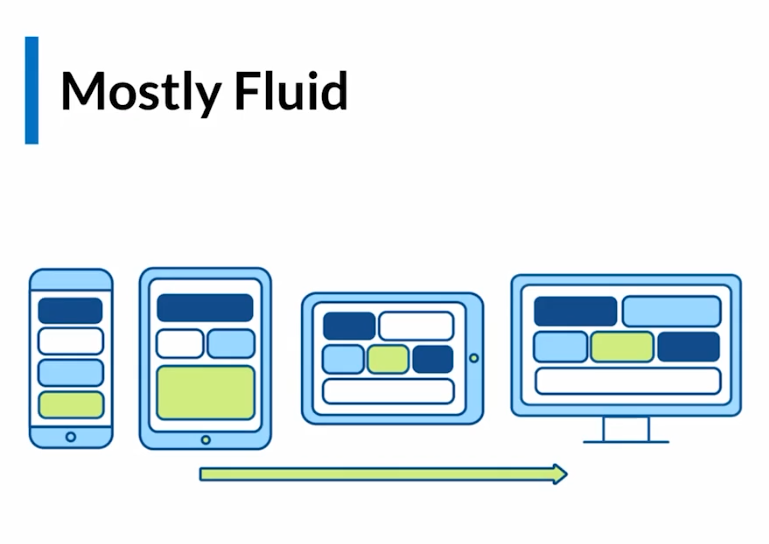

# Patrones de maquetación Responsive Design
Los patrones de diseño en maquetación para responsive, se adaptan segun el tipo de layout que queramos mostrar al usuario. Existen tres mas comúnmente utilizados:

- Mostly Fluid
- Layout Shifter
- Column Drop

 

## Mostly fluid
Inicia con columnas en dispositivos móviles, conforme va creciendo la pantalla, se re-acomodan esas columnas.

 

## Layout Shifter

Este tipo de patrón tiene ciertos contenedores padres que se van re-posicionar con mas contenedores adentro.

