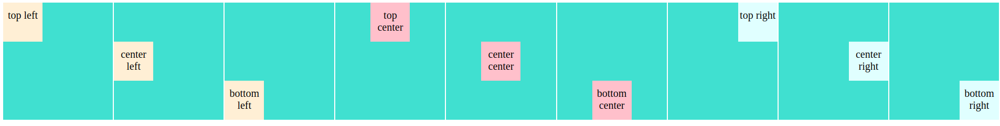
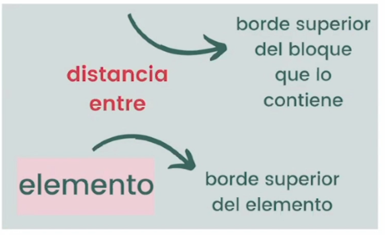

# Control de Alineamiento

## Tecnicas de alineamiento antes de CSS Grid: 

### 1. margin

```css
/* Individual margin properties */

p {
    margin-top: 10px;
    margin-right: 10px;
    margin-bottom: 10px;
    margin-left: 10px;
}

/* Shorthand property */

p {
    margin: 10px 10px 10px 10px; /* top, right, bottom and left respectively */
}
```

<br>

Ejemplo:

```html
<div class="wrapper">
  <div class="container">
    <div class="element1">top left</div>
  </div>

  <div class="container">
    <div class="element2">center left</div>
  </div>

  <div class="container">
    <div class="element3">bottom left</div>
  </div>

  <div class="container">
    <div class="element4">top center</div>
  </div>

  <div class="container">
    <div class="element5">center center</div>
  </div>

  <div class="container">
    <div class="element6">bottom center</div>
  </div>
  
  <div class="container">
    <div class="element7">top right</div>
  </div>
  
  <div class="container">
    <div class="element8">center right</div>
  </div>

  <div class="container">
    <div class="element9">bottom right</div>
  </div>
</div>
```

```css
@import url('https://fonts.googleapis.com/css2?family=Lato&display=swap');

.wrapper {
  display: grid;
  grid-template-columns: repeat(3, 1fr);
  grid-gap: 5px;
  font-family: 'Lato', sans-serif;
  width: 550px;
}

.container {
  background: turquoise;
  width: 180px;
  height: 180px;
}

.element {
  width: 60px;
  height: 60px;
  text-align: center;
  padding-top: 10px;
  box-sizing: border-box;
}

.element1 {
  @extend .element;
  background: papayawhip;
  margin: 0; 
}

.element2 {
  @extend .element;
  background: papayawhip;
  margin: 60px 0;
}

.element3 {
  @extend .element;
  background: papayawhip;
  margin: 120px 0;
}

.element4 {
  @extend .element;
  background: pink;
  margin: 0 auto;
}

.element5 {
  @extend .element;
  background: pink;
  margin: 60px auto;
}

.element6 {
  @extend .element;
  background: pink;
  margin: 120px auto;
}

.element7 {
  @extend .element;
  background: lightcyan;
  margin: 0 0 0 auto;
}

.element8 {
  @extend .element;
  background: lightcyan;
  margin: 60px 0 0 auto;
}

.element9 {
  @extend .element;
  background: lightcyan;
  margin: 120px 0 0 auto;
}
```


<br>
<br>

### 2. line-height

```css
/* Alinea de manera horizontal */

text-align: left|right|center|justify|initial|inherit;

/* Alinea de manera vertical */

vertical-align: baseline|length|sub|super|top|text-top|middle|bottom|text-bottom|initial|inherit;

/* Controla los altos en los textos */

line-height: normal|number|length|initial|inherit;
```

```html
<div class="wrapper">
  <div class="container1">
    <div class="element1">top left</div>
  </div>

  <div class="container1">
    <div class="element2">center left</div>
  </div>

  <div class="container1">
    <div class="element3">bottom left</div>
  </div>

  <div class="container2">
    <div class="element4">top center</div>
  </div>

  <div class="container2">
    <div class="element5">center center</div>
  </div>

  <div class="container2">
    <div class="element6">bottom center</div>
  </div>
  
  <div class="container3">
    <div class="element7">top right</div>
  </div>
  
  <div class="container3">
    <div class="element8">center right</div>
  </div>

  <div class="container3">
    <div class="element9">bottom right</div>
  </div>
</div>
```
```css
@import url('https://fonts.googleapis.com/css2?family=Lato&display=swap');

.wrapper {
  display: grid;
  grid-template-columns: repeat(3, 1fr);
  grid-gap: 5px;
  font-family: 'Lato', sans-serif;
  width: 550px;
}

.container {
  background: turquoise;
  width: 180px;
  height: 180px;
}

.element {
  width: 60px;
  height: 60px;
  text-align: center;
  padding-top: 10px;
  box-sizing: border-box;
}

.container1 {
  @extend .container;
  text-align: left;
  line-height: 180px;
}

.element1 {
  @extend .element;
  background: papayawhip;
  display: inline-block;
  line-height: 45px;
  vertical-align: top;
}

.element2 {
  @extend .element;
  background: papayawhip;
  display: inline-block;
  line-height: 20px;
  vertical-align: middle;
}

.element3 {
  @extend .element;
  background: papayawhip;
  display: inline-block;
  line-height: 20px;
  vertical-align: bottom;
}

.container2 {
  @extend .container;
  text-align: center;
  line-height: 180px;
}

.element4 {
  @extend .element;
  background: pink;
  display: inline-block;
  line-height: 20px;
  vertical-align: top;
}

.element5 {
  @extend .element;
  background: pink;
  display: inline-block;
  line-height: 20px;
  vertical-align: middle;
}

.element6 {
  @extend .element;
  background: pink;
  display: inline-block;
  line-height: 20px;
  vertical-align: bottom;
}

.container3 {
  @extend .container;
  text-align: right;
  line-height: 180px;
}

.element7 {
  @extend .element;
  background: lightcyan;
  display: inline-block;
  line-height: 20px;
  vertical-align: top;
}

.element8 {
  @extend .element;
  background: lightcyan;
  display: inline-block;
  line-height: 20px;
  vertical-align: middle;
}

.element9 {
  @extend .element;
  background: lightcyan;
  display: inline-block;
  line-height: 20px;
  vertical-align: bottom;
}
```


<br>
<br>

### 3. Table-cell

```css
/* Hace que cualquier elemento se comporte como si fuera un elemento de tabla */

display: table-cell;

/* Alinea de manera horizontal */

text-align: left|right|center|justify|initial|inherit;

/* Alinea de manera vertical */

vertical-align: baseline|length|sub|super|top|text-top|middle|bottom|text-bottom|initial|inherit; 
```

**Formato de tabla**
display: | tag
:---: | :---:
table | table          
table-cell | td
table-row | tr
table-column | col 
table-column-group | colgroup
table-footer-group | tfoot
table-header-group | thead


```html
<div class="container1">
  <div class="element1">top left</div>
</div>

<div class="container2">
  <div class="element1">center left</div>
</div>

<div class="container3">
  <div class="element1">bottom left</div>
</div>

<div class="container4">
  <div class="element2">top center</div>
</div>

<div class="container5">
  <div class="element2">center center</div>
</div>

<div class="container6">
  <div class="element2">bottom center</div>
</div>

<div class="container7">
  <div class="element3">top right</div>
</div>

<div class="container8">
  <div class="element3">center right</div>
</div>

<div class="container9">
  <div class="element3">bottom right</div>
</div>
```

```css
@import url('https://fonts.googleapis.com/css2?family=Lato&display=swap');

.element {
  width: 60px;
  height: 60px;
  text-align: center;
  padding-top: 10px;
  box-sizing: border-box;
}

.element1 {
  @extend .element;
  background: papayawhip;
  display: inline-block;
}

.element2 {
  @extend .element;
  background: pink;
  display: inline-block;
}

.element3 {
  @extend .element;
  background: lightcyan;
  display: inline-block;
}

.container {
  background: turquoise;
  border: 1px solid white;
  width: 180px;
  height: 180px;
}

.container1 {
  @extend .container;
  display: table-cell;
  text-align: left;
  vertical-align: top;
}

.container2 {
  @extend .container;
  display: table-cell;
  text-align: left;
  vertical-align: middle;
}

.container3 {
  @extend .container;
  display: table-cell;
  text-align: left;
  vertical-align: bottom;
}

.container4 {
  @extend .container;
  display: table-cell;
  text-align: center;
  vertical-align: top;
}

.container5 {
  @extend .container;
  display: table-cell;
  text-align: center;
  vertical-align: middle;
}

.container6 {
  @extend .container;
  display: table-cell;
  text-align: center;
  vertical-align: bottom;
}

.container7 {
  @extend .container;
  display: table-cell;
  text-align: right;
  vertical-align: top;
}

.container8 {
  @extend .container;
  display: table-cell;
  text-align: right;
  vertical-align: middle;
}

.container9 {
  @extend .container;
  display: table-cell;
  text-align: right;
  vertical-align: bottom;
}
```



<br>
<br>

### 4. Position

```css
position: relative | absolute;
top: 10px;
right: 10px;
bottom: 10px;
left: 10px;
transform: translate();
```

**Positions**

_ | static | relative | absolute | fixed
:---: | :---: | :---: | :---: | :---:
Posicionado de acuerdo al flujo normal | ✅ | ✅ | ❌ | ❌
Su posición final la determinan top, right, bottom, y left | ❌ | ✅ | ✅ | ✅
Crea un nuevo contexto de apilamiento | ❌ | ✅ si z-idnex != auto | ✅ si z-idnex != auto  | ✅

<br>

**Position absolute**
Cuando trabajamos con absolute, notaremos que el valor top siempre es la distancia entre el contenedor y el elemento



**Position relative**
cuando trabajamos con relative, al seguir ésta el flujo normal, determina el desplazamiento hacia abajo que tendrá con respecto a su posición normal.

<br>
<br>

#### Sintaxis
top, right, bottom y left
- **longitud**: px, em, rem...
- **porcentaje**: %
- **auto**: valor por defecto
- **inherit**: heredada

transform
- none
- transform-functions
- initial
- inherit
- translate(x,y)

```html
<div class="wrapper">
  <div class="container">
    <div class="element1">top left</div>
  </div>

  <div class="container">
    <div class="element2">center left</div>
  </div>

  <div class="container">
    <div class="element3">bottom left</div>
  </div>

  <div class="container">
    <div class="element4">top center</div>
  </div>

  <div class="container">
    <div class="element5">center center</div>
  </div>

  <div class="container">
    <div class="element6">bottom center</div>
  </div>
  
  <div class="container">
    <div class="element7">top right</div>
  </div>
  
  <div class="container">
    <div class="element8">center right</div>
  </div>

  <div class="container">
    <div class="element9">bottom right</div>
  </div>
</div>
```

```css
@import url('https://fonts.googleapis.com/css2?family=Lato&display=swap');

.wrapper {
  display: grid;
  grid-template-columns: repeat(3, 1fr);
  grid-gap: 5px;
  font-family: 'Lato', sans-serif;
  width: 550px;
}

.container {
  background: turquoise;
  width: 180px;
  height: 180px;
  position: relative;
}

.element {
  width: 60px;
  height: 60px;
  text-align: center;
  padding-top: 10px;
  box-sizing: border-box;
}

.element1 {
  @extend .element;
  background: papayawhip;
  position: absolute;
  left: 0;
  top: 0;
}

.element2 {
  @extend .element;
  background: papayawhip;
  position: absolute;
  left: 0;
  top: 50%;
  transform: translate(0, -50%);
}

.element3 {
  @extend .element;
  background: papayawhip;
  position: absolute;
  left: 0;
  top: 100%;
  transform: translate(0, -100%);
}

.element4 {
  @extend .element;
  background: pink;
  position: absolute;
  left: 50%;
  transform: translate(-50%, 0);
}

.element5 {
  @extend .element;
  background: pink;
  position: absolute;
  left: 50%;
  top: 50%;
  transform: translate(-50%, -50%);
}

.element6 {
  @extend .element;
  background: pink;
  position: absolute;
  left: 50%;
  top: 100%;
  transform: translate(-50%, -100%);
}

.element7 {
  @extend .element;
  background: lightcyan;
  position: absolute;
  left: 100%;
  transform: translate(-100%, 0);
}

.element8 {
  @extend .element;
  background: lightcyan;
  position: absolute;
  left: 100%;
  top: 50%;
  transform: translate(-100%, -50%);
}

.element9 {
  @extend .element;
  background: lightcyan;
  position: absolute;
  left: 100%;
  top: 100%;
  transform: translate(-100%, -100%);
}
```


<br>
<br>
<br>

## Pros y Contras de estas técnicas

Son meramente trucos, no hay ninguna propiedad específica para alinear elementos de bloque.

### margin
**Pros**: El valor auto nos alinea horizontalmente cualquier elemento con cualquier ancho.  
**Contras**: Alinear verticalmente se tiene que calcular los valores de container y  dependiendo el caso.

### line-height
**Pros**: Correcta alineación.  
**Contras**: Si el texto ocupa más de una línea el elemento toma un alto más grande que lo necesario para los cálculos.

### Table-cell
**Pros**: La alineación vertical no está condicionada por fuentes, tamaños de fuentes o alturas de líneas.
**Contras**: Vertical-align se aplica sólo a elemento inline.

<br>

### Mayor limitante
Propiedades física:

- margin-top
- padding-bottom
- border-right
- left

Debemos cambiar estas limitantes por:

Propiedades lógicas, modos de escritura