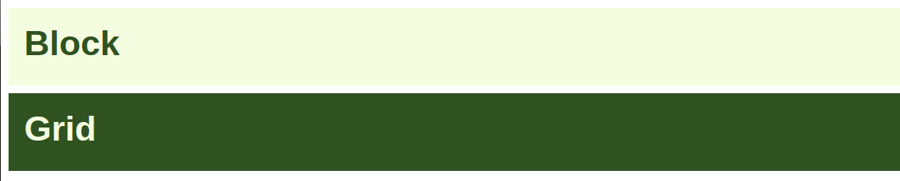
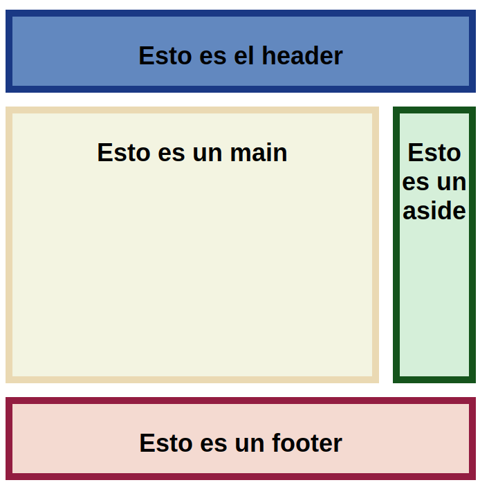

# Propiedades y valores para el elemento padre

## Display: grid e inline-grid

la definición del vocablo en inglés *display* es:

Verbo; desplegar, colocar a la vista, exhibir, lucir, mostrar, presentar.

En el contexto de CSS, display define el tipo de visualización de un elemento, y puede tener dos valores, inner y outter

<br>

**¿Cuál es la diferencia entre grid e inline-grid?**

Si declaráramos la propiedad display a dos elementos, por ejemplo div (que por defecto es de tipo block), uno con valor block y otro con valor grid, al revisarlo en el navegador veríamos que no cambia, se verían exactamente igual.

```html
<div class="block">
    Block
</div>
<div class="grid">
    Grid
</div>
```
```css
body {
  font-family: 'Roboto', sans-serif;
  font-weight: bolder;
  padding: 0;
  margin: 0;
}
div {
  font-size: 45px;
  width: 100%;
  height: 60px;
  padding: 20px;
  margin: 10px;
}
.block {
  background-color: #F6FCDF;
  color: #31511E;
  display: block;
}
.grid {
  background-color: #31511E;
  color: #F6FCDF;
  display: grid;
}
```

<br>



Esto es debido a que la propiedad `display: grid` tiene también y por defecto, la propiedad block, prácticamente es como si nosotros lo declaráramos así: `display: block-grid`

<br>

Los valores block e inline nos van a definer dos cosas: 
- **El valor externo de visualización**: El cómo se comporta el elemento en el diseño junto con otros elementos.
- **El valor interno de visualización**: Es cómo se comportan los hijos directos de ese elemento.

Es decir que, al aplicarle un estilo con la propiedad display, con el valor block-grid a un elemento container, lo que le estamos diciendo es que de manera externa, se comportará como un elemento tipo block, y de manera interna, sus hijos directos tendrán un comportamiento de visualización grid.

Entonces si tenemos que block-grid (o simplemente grid), ajusta la visualización de un elemento en tipo bloque podemos deducir que los elementos declarados con `display: inline-grid` se comportarán como un elemento inline, y en el ejemplo anterior, si cambiamos el valor de display por inline e inline-grid respectivamente obtendremos esto:

```css
.block {
  display: inline;
}
.grid {
  display: inline-grid;
}
```


<br>

Aquí debemos recalcar el concepto de flujo normal del documento, el cual hace referencia a que todos los elementos de un documento html, por defecto ya traen un tipo de display, ésto sin haberle agregado un estilo con css previamente.

En CSS2 teniamos los siguientes tipos de display:

- inline
- block
- inline-block
- list-item
- none
- table
- inline-table

Entre muchas otras, pero estas son las más importantes

<br>

Para CSS3 se agregaron las de grid y flexbox:
- flex
- inline-flex
- grid
- inline-grid

<br>
<br>

## Filas, columnas y espaciado

Para crear las filas y columnas tenemos varias formas de hacerlo, podemos comenzar con lo mas simple:

<br>

Tenemos un container con 25 items.
```html
<div class="container">
  <div class="item"></div>
  .
  .
  .
  <div class="item"></div> 
</div>
```

Y aplicamos los siguientes estilos
```css
.container {
  display: grid;
  grid-template-rows: 50px 50px 50px 50px 50px;
  grid-template-columns: 50px 50px 50px 50px 50px;
  width: max-content;
  background-color: #F3F3E0;
}

.item {
  width: 50px;
  height:50px;
  border: 1px solid #000000;
}
```

<br>


<br>

Tendríamos el mismo efecto y acortariamos un poco y aplicariamos el paradigma de diseño DRY con el valor `repeat()`:

```css
.container {
  display: grid;
  grid-template-rows: repeat(5, 50px); /* el primer valor es la cantidad de veces que queremos que se repita, y el segundo la medida. */
  grid-template-columns: repeat(5, 50px);
}
```

Y se puede hacer aún más simple solamente con `grid-template`

```css
.container {
    display:grid;
    grid-template: repeat(5, 20px) / repeat(5,20px); /* El primer valor serian las filas y el segundo las columnas */
}
```

<br>

Para colocar espacios entre filas y columnas usamos `column-gap` y `row-gap` o sus formas mas largas que se utilizaban anteriormente `grid-column-gap` y `grid-row-gap`, cualquiera de las dos es válida.

```css
.container1 {
    grid-column-gap: 7px;
    grid-row-gap: 5px;
}
.container2 {
    column-gap: 7px;
    row-gap: 5px;
}
```

O podemos unificar las dos anteriores con `gap`, podemos agregar el epacio uniformemente a filas y columnas o colocando los dos valores.
```css
.container1 {
    gap: 5px;
}
.container2 {
    gap: 5px 7px; /* primer valor: filas, segundo: columnas */
}
```

<br>

Una forma más compleja de generar un layout, pero bastante facil de hacer seria con `grid-template-areas`

```html
<div class="container">
<header>
  <p>Esto es el header</p>
</header>
<main>
  <p>Esto es un main</p>
</main>
<aside>
  <p>Esto es un aside</p>
</aside>
<footer>
  <p>Esto es un footer</p>
</footer>
</div>
```

```css
body {
  box-sizing: border-box;
}
.container {
  display: grid;
  grid-template: repeat(5, 50px) / repeat(5,50px);
  grid-template-areas:
    "header header header header header"
    "main   main   main   main     aside"
    "main   main   main   main     aside"
    "main   main   main   main     aside"
    "footer footer footer footer footer";
  gap: 20px;
  text-align: center;
  font-size: 18px;
  font-weight: bold;
  font-family: 'Roboto', sans-serif;
}

header {
  grid-area: header;
  width: 100%;
  height: 100%;
  background-color: #608BC1;
  border: 5px solid #133E87;
}
main {
  grid-area: main;
  width: 100%;
  height: 100%;
  background-color: #F3F3E0;
  border: 5px solid #EAD8B1;
}

aside {
  grid-area: aside;
  width: 100%;
  height: 100%;
  background-color: #D6EFD8;
  border: 5px solid #1A5319;
}

footer {
  grid-area: footer;
  width: 100%;
  height: 100%;
  background-color: #F4D9D0;
  border: 5px solid #921A40;
}
```

Se crean nombres para cada una de las celdas para despues asignar las areas a los elementos con `grid-area`, dando ésto como resultado:

