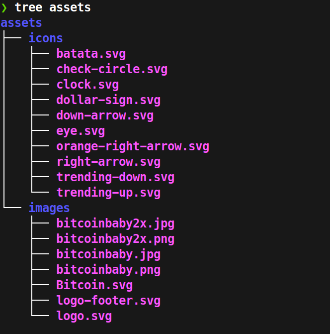

# Arquitectura Incial del Proyecto

Como vimos en la clase anterior, el proyecto consta de:

- Header
- 4 secciones
- Footer

<br>

Creamos nuestro archivo index.html
```html
<!DOCTYPE html>
<html lang="en">
<head>
    <meta charset="UTF-8">
    <meta name="viewport" content="width=device-width, initial-scale=1.0">
    <title>Document</title>
</head>
<body>
    <header></header>
    <main>
        <section></section>
        <section></section>
        <section></section>
        <section></section>
    </main>
    <footer></footer>
</body>
</html>
```

<br>

## Assets

Para tener un orden, todos los iconos, fotos, imagenes, fuentes, todo lo que usaremos dentro de nuestro proyecto debemos organizarlo en una carpeta con el nombre assets.



<br>

## Fuentes

Por buenas practicas, no puede haber mas de dos fuentes.

Hay dos formas de aplicar las fuentes por medio de url, una es con el tag link en html y otra es con @import en css, la mejor manera y considerado buena práctica es a través del tag link en html:

Utilizaremos esta:
```html
<link
      href="https://fonts.googleapis.com/css2?family=DM+Sans:wght@400;500;700&family=Inter:wght@300;500;900&display=swap"
      rel="stylesheet"
    />
```
```css
html {
    font-family: "DM Sans", sans-serif;
}
```