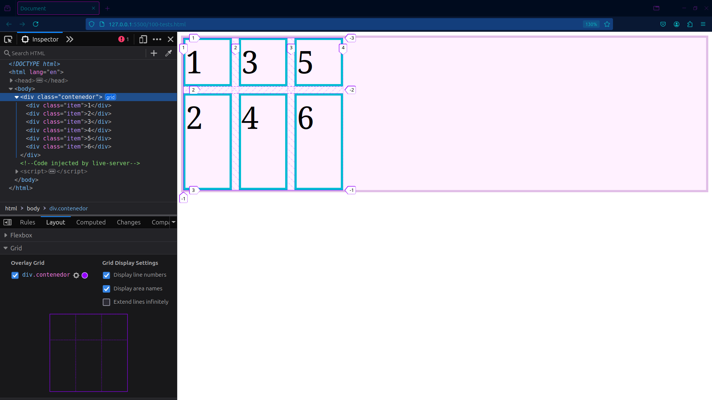

# Propiedades del Contenedor
Todas la siguientes son propiedades que nos permiten crear una grilla, definir su cantidad de columnas y filas, y definir los espaciados entre estas mismas

- `display: grid`
- `grid-template`
- `gap`
- `grid-auto`

<br>

Aquí tenemos nuestro primer ejemplo:  

<br>

Tenemos un contenedor con 6 objetos block a los cuales les aplicamos las propiedades `grid-template-column` y `grid-template-row` definiendo sus tamaños.

CSS:
```css
.contenedor {
    border: 5px solid #e1bee7;
    background-color: #fff1ff;
    display: grid;
    grid-template-columns: 100px 200px 300px;
    grid-template-rows: 150px 250px;
}
.item {
    border: 5px solid #00bcd4;
    font-size: 4rem;
}
```
HTML:
```html
<body>
    <div class="contenedor">
        <div class="item">1</div>
        <div class="item">2</div>
        <div class="item">3</div>
        <div class="item">4</div>
        <div class="item">5</div>
        <div class="item">6</div>
    </div>
</body>
```
<br>

Esto da como resultado 3 columnas de 100, 200 y 300 pixeles de izquierda a derecha respectivamente, 2 filas de 150 y 250 pixeles de arriba hacia abajo respectivamente.

<br>


<br>
<br>

También podemos utilizar las propiedades `grid-auto-column` y `grid-auto-row` para que CSSGrid nos cree las columnas y filas automáticamente, ya solo tendremos que definir el tamaño que qeremos para cada una de las dos.

<br>

Aquí esta la muestra con el mismo html:

<br>

```css
.contenedor {
    border: 5px solid #e1bee7;
    background-color: #fff1ff;
    display: grid;
    grid-template-columns: 100px 200px 300px;
    grid-auto-rows: 150px;
}
.item {
    border: 5px solid #00bcd4;
    font-size: 4rem;
}
```

<br>


<br>
<br>

Por defecto, Grid va rellenando las celdas con los items de izquierda a derecha de arriba hacia abajo, como lo podemos ver en los ejemplos anteriores.  
Es posible cambiar ese comportamiento y ajustar el orden como queramos, utilizando `grid-auto-flow`:

<br>

```css
.contenedor {
    border: 5px solid #e1bee7;
    background-color: #fff1ff;
    display: grid;
    grid-template-rows: 100px 200px;
    grid-auto-columns: 100px;
    grid-auto-flow: column;
}
.item {
    border: 5px solid #00bcd4;
    font-size: 4rem;
}
```

<br>


<br>
<br>

También es posible crear brechas o espacios entre filas y columnas. 
Lo podemos hacer con la propiedad `gap`:

<br>

```css
.contenedor {
    border: 5px solid #e1bee7;
    background-color: #fff1ff;
    display: grid;
    grid-template-rows: 100px 200px;
    grid-auto-columns: 100px;
    grid-auto-flow: column;
    row-gap: 15px;
    column-gap: 15px; 
}
.item {
    border: 5px solid #00bcd4;
    font-size: 4rem;
}
```

<br>


