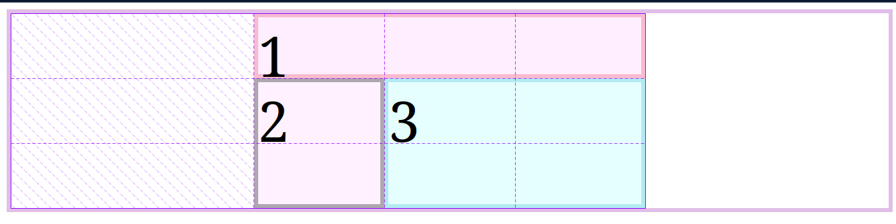

# Propiedades de Ubicación
Con esta propiedad podemos ubicar los elementos de nuestro grid en las celdas que deseemos.  
Lo vamos a poder lograr con las propiedades:

- **Grid-column-[start | end]**: Se indica el inicio con start y final con end
- **Grid-row-[start | end]**: Se indica el inicio con start y final con end
- **Grid-[column | row]** se indica inicio y final separado con una diagonal `grid-column: 1 / 4;`
- **Grid-area**: Se indica la fila de inicio, seguido de la columna de inicio, después la fila en la que termina y por último columna en la que termina, todo separado con diagonales `grid-area: 2 / 2 / 4 / 4;`

<br>

Aquí comenzamos con un grid de 3x3, 3 columnas de 150px y 3 filas de 75px.  
Con 3 items que tienen cada uno su propio color de borde y de fondo. El primer elemento supone un Header, el segundo un Aside y el tercero un Main.
```html
<body>
    <div class="contenedor">
        <div class="item item-1">1</div>
        <div class="item item-2">2</div>
        <div class="item item-3">3</div>
    </div>
</body>
```

```css
.contenedor {
    border: 5px solid #e1bee7;
    background-color: white;
    display: grid;
    grid-template-columns: 150px 150px 150px;
    grid-template-rows: 75px 75px 75px;
    place-content: center;
}
.item {
    font-size: 4rem;
}
.item-1 {
    border: 5px solid #f8bbd0;
    background-color: #ffeeff;
}
.item-2 {
    border: 5px solid #aea7af;
    background-color: #fff1ff;
}
.item-3 {
    border: 5px solid #b2ebf2;
    background-color: #e5ffff;

}
```

<br>


<br>
<br>

El layout que queremos es que el primer elemento tome las 3 celdas horizontales, el segundo la segunda y la tercera celda en vertical y el tercero el resto.

Lo haremos de la siguiente forma:

```css
.item-1 {
    border: 5px solid #f8bbd0;
    background-color: #ffeeff;
    grid-column-start: 1;
    grid-column-end: 4;
}
.item-2 {
    border: 5px solid #aea7af;
    background-color: #fff1ff;
    grid-row: 2 / 4;
}
.item-3 {
    border: 5px solid #b2ebf2;
    background-color: #e5ffff;
    grid-area: 2 / 2 / 4 / 4;

}
```

<br>



<br>
<br>

También es posible hacer esto con otra propiedad declarandola en el grid container la cual es: `grid-template-areas`.  
Esta propiedad nos permite crear una plantilla, dandole nombre a las celadas que van a ocupar nuestros elementos, para despues darle la ubicacion a los items con la propiedad `grid-area` seguido del nombre del area que designamos en `grid-template-areas`. Para el caso anterior nos quedaria de la siguiente manera:

```css
.contenedor {
    grid-template-areas: 
    "header header header" 
    "side main main" 
    "side main main";
}
.item-1 {
    border: 5px solid #f8bbd0;
    background-color: #ffeeff;
    grid-area: header;
}
.item-2 {
    border: 5px solid #aea7af;
    background-color: #fff1ff;
    grid-area: aside;
}
.item-3 {
    border: 5px solid #b2ebf2;
    background-color: #e5ffff;
    grid-area: main;
}
```

De esta manera nos daria el mismo resultado.