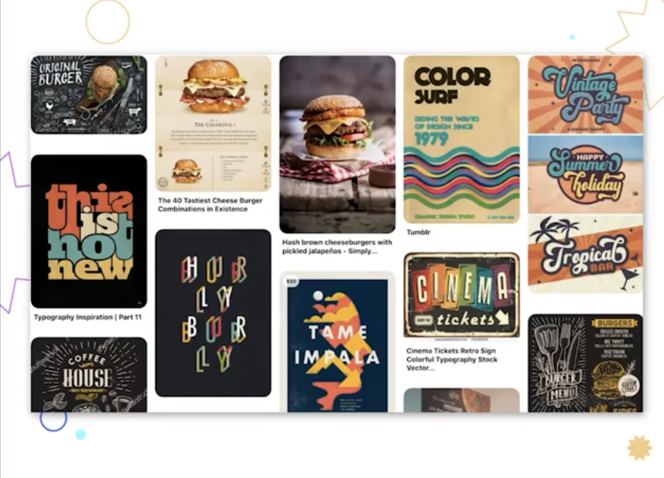

# Moodboard y línea gráfica

Es una colección de referencias visuales, de estilos, de colores que se usa como fuente de inspiración para un diseño. Por ejemplo fotografías, ilustraciones, colores, tipografías, etc.

 

Puede ser creado con recortes o aplicaciones como pinterest

