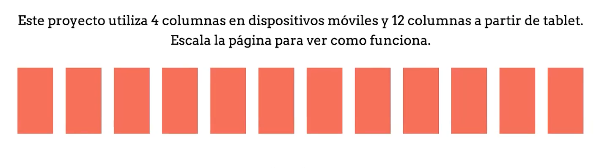

# Layout y sistemas de grillas
Otro de los elementos mas importantes de una pagina web es una grilla.  
Es un sistema de columnas y filas creada de acuerdo a nuestras necesidades.

 

 

Nos ayuda a ahorrar tiempo cuando tenemos varios elementos del mismo tamaño.