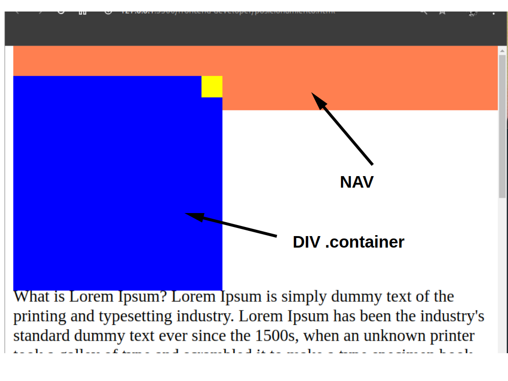

# Z-index y el Contexto de Apilamiento

Nos habla de un eje `z` que es invisible para nosotros, el cual tiene una dirección de la pantalla hacia el usuario, básicamente es tener los diferentes elementos de html uno encima de otro.
e
El orden de los elementos en html determina el orden en el que aparecen o se organizan las capas en razón de ese eje `z`

<br>

Todos los elementos que estén por debajo de otros prevalecerán en la parte de enfrente de la pantalla y los que están hasta arriba estarán por detrás de los que están abajo.  
Z-index funciona con ciertos tipos de position, y para utilizarlo, se coloca la propiedad z-`index` seguido del indice que queremos para el objeto. Siendo, que por ejemplo, tenemos un div con z-index:1 y otro div z-index:2, a lo cual, el segundo será mostrado por encima del primer. A mayor numero de indice sera mostrado  de primero.

Como en el caso anterior:



Esto se debe a que el div .container se encuentra por debajo del nav:

```html
 <nav></nav>
    <div class="container">
        <div class="item"></div>
    </div>
```

Aquí tenemos un caso que muestra la forma en que opera el z-index:


Tenemos dos divs hermanos, un div "blue" con z-index:4 y un div "red" con z-index:5, por lo cual red será mostrado antes que blue, pero ¿qué pasa con el div "yellow"?, este no es hermano ni de "blue" ni de "red", es hijo de "blue", por esta razón será mostrado  después de red, ya que pertenence a "blue", y "blue" es menor que red. Por muy grande que sea el indice de yellow jamás se mostrará antes que red por esta razon, pero si será mostrado antes que blue.

<br>
<br>

[Ejercicio](frontend-developer/z-index.html)