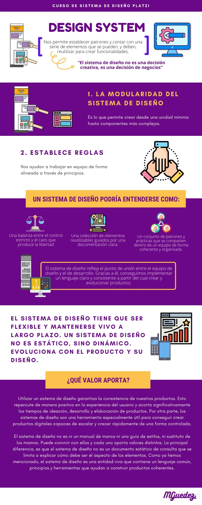

# ¿Qué es un sistema de diseño?
Es un conjunto de reglas para un producto que se modifica o puede mutar dependiendo de las necesidades del mismo.
También se puede ver como un método simplificado para resolver problemas de creación de productos.

 
 

 

 Créditos de la infografía:

 

 Programas a utilizar:

 - Notion
 - Coggle.it