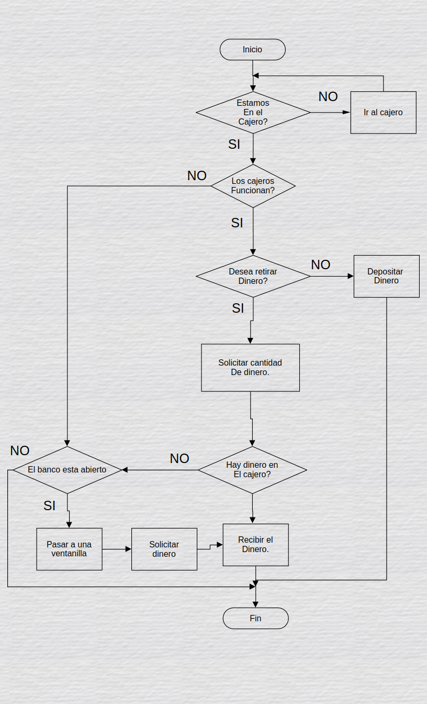

# Reto 1: ¿Hay dinero en el cajero electrónico?

Inicio  
Estoy en el cajero?  
si = solicitar cantidad de dinero y pasar a linea 7  
no = ir al cajero y regresar a linea 4  
Hay dinero en el cajero?  
si = nos da el dinero  
no = volver a solicitar regresa a linea 5  
fin  

 
 

Optimizar este proceso.

